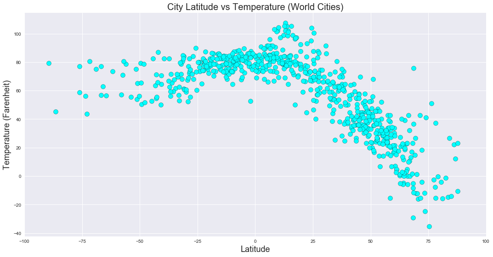
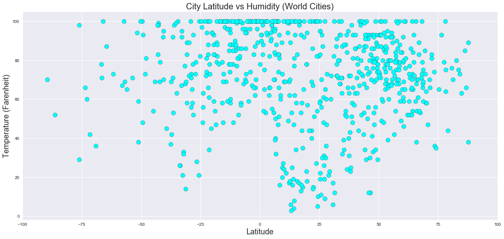
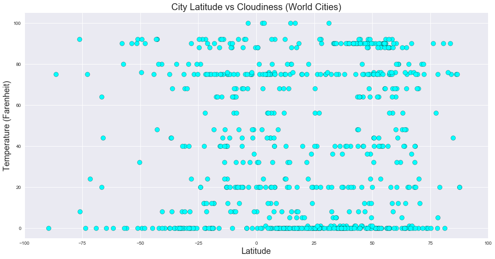
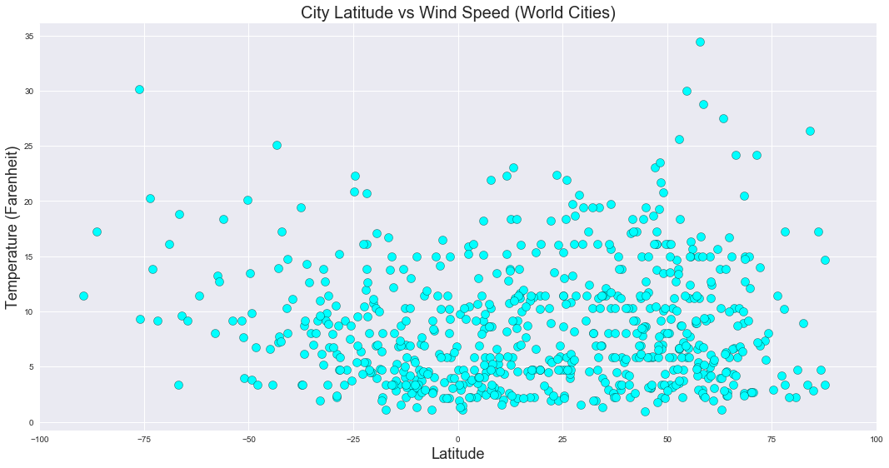

Observed Trends:

1. The closer a city is to the equator (a lower absolute value of latitude), the higher the temperature of the city is.
2. Surprisingly, the humidity in a city does not have a strong correlate with the temperature or latitude. Cities across the entire latitude range have similar humidity levels. This observation applies to the cloudiness percentage for each city, and for the wind speed for each city.
3. However, the highest wind speeds appeared farthest away from the equator, and those cities approximately 20 degrees North or South of the equator had the lowest humidity percentages.


```python
# Dependencies
import csv
import matplotlib.pyplot as plt
import numpy as np
import requests
import pandas as pd
import openweathermapy.core as owm
from citipy import citipy
from pprint import pprint
import seaborn as sns


#API config key
from config import api_key
```


```python
# Create latitudes and longitudes

latitude = np.random.uniform(-90,90,2000) # Random list of 2000 items with a range of -90 to +90
longitude = np.random.uniform(-180,180,2000) # Random list of 2000 items with a range of -180 + 180

#print (latitude)
#print (longitude)
```


```python
# Create initial Cities Dataframe for 10 Latitudes and Longitudes
city_df = pd.DataFrame({"Latitude": latitude, "Longitude": longitude})
city_df.head()
```


<div>
<style scoped>
    .dataframe tbody tr th:only-of-type {
        vertical-align: middle;
    }

    .dataframe tbody tr th {
        vertical-align: top;
    }

    .dataframe thead th {
        text-align: right;
    }
</style>
<table border="1" class="dataframe">
  <thead>
    <tr style="text-align: right;">
      <th></th>
      <th>Latitude</th>
      <th>Longitude</th>
    </tr>
  </thead>
  <tbody>
    <tr>
      <th>0</th>
      <td>-66.077809</td>
      <td>88.290853</td>
    </tr>
    <tr>
      <th>1</th>
      <td>52.356347</td>
      <td>69.975055</td>
    </tr>
    <tr>
      <th>2</th>
      <td>-21.543343</td>
      <td>42.959799</td>
    </tr>
    <tr>
      <th>3</th>
      <td>83.597567</td>
      <td>-109.241022</td>
    </tr>
    <tr>
      <th>4</th>
      <td>55.723040</td>
      <td>93.307338</td>
    </tr>
  </tbody>
</table>
</div>


```python
# Add additional columns Cities, Temperature, Humidity, Cloudiness and Wind Speed to city_df 
# Note that we used "" to specify initial entry.

city_df["City"] = ""
city_df["Country Code"] = ""
city_df["Temperature"] = ""
city_df["Cloudiness"] = ""
city_df["Wind Speed"] = ""
city_df["Humidity"] = ""
#city_df["URL"] = ""
city_df.head()
```


<div>
<style scoped>
    .dataframe tbody tr th:only-of-type {
        vertical-align: middle;
    }

    .dataframe tbody tr th {
        vertical-align: top;
    }

    .dataframe thead th {
        text-align: right;
    }
</style>
<table border="1" class="dataframe">
  <thead>
    <tr style="text-align: right;">
      <th></th>
      <th>Latitude</th>
      <th>Longitude</th>
      <th>City</th>
      <th>Country Code</th>
      <th>Temperature</th>
      <th>Cloudiness</th>
      <th>Wind Speed</th>
      <th>Humidity</th>
    </tr>
  </thead>
  <tbody>
    <tr>
      <th>0</th>
      <td>-66.077809</td>
      <td>88.290853</td>
      <td></td>
      <td></td>
      <td></td>
      <td></td>
      <td></td>
      <td></td>
    </tr>
    <tr>
      <th>1</th>
      <td>52.356347</td>
      <td>69.975055</td>
      <td></td>
      <td></td>
      <td></td>
      <td></td>
      <td></td>
      <td></td>
    </tr>
    <tr>
      <th>2</th>
      <td>-21.543343</td>
      <td>42.959799</td>
      <td></td>
      <td></td>
      <td></td>
      <td></td>
      <td></td>
      <td></td>
    </tr>
    <tr>
      <th>3</th>
      <td>83.597567</td>
      <td>-109.241022</td>
      <td></td>
      <td></td>
      <td></td>
      <td></td>
      <td></td>
      <td></td>
    </tr>
    <tr>
      <th>4</th>
      <td>55.723040</td>
      <td>93.307338</td>
      <td></td>
      <td></td>
      <td></td>
      <td></td>
      <td></td>
      <td></td>
    </tr>
  </tbody>
</table>
</div>


```python
# Pull the values of Cities for each Latitude and Longitude and append those values in the City column
# Loop through the city_df and run a latitude/longitude search for each city and its respective country code,
# and append the corresponding values

for index, row in city_df.iterrows():
    latitude = row['Latitude']
    longitude = row ["Longitude"]
    
    city_df.set_value(index, "City", citipy.nearest_city(latitude, longitude).city_name)
    city_df.set_value(index, "Country Code", citipy.nearest_city(latitude, longitude).country_code)

city_df = city_df.drop_duplicates(subset=["City","Country Code"], keep="first")

```

    C:\Users\santo\Anaconda3\envs\PythonData\lib\site-packages\ipykernel_launcher.py:9: FutureWarning: set_value is deprecated and will be removed in a future release. Please use .at[] or .iat[] accessors instead
      if __name__ == '__main__':
    C:\Users\santo\Anaconda3\envs\PythonData\lib\site-packages\ipykernel_launcher.py:10: FutureWarning: set_value is deprecated and will be removed in a future release. Please use .at[] or .iat[] accessors instead
      # Remove the CWD from sys.path while we load stuff.
    


```python
# Construct the base url to pull the information from openweatherapi
#base_url = "http://api.openweathermap.org/data/2.5/weather"
base_url = "http://api.openweathermap.org/data/2.5/weather?units=Imperial"
```


```python
# Loop through the city_df and call the target url to pull the required information
# Print Retrieving Information and Log

print("Beginning Data Retrieval" + "\n" + "------------------------")

for index, row in city_df.iterrows():
    city = row['City']
    country = row ["Country Code"]
    city_country = str(city)+ "," + str(country)
    
    try:
        #current_weather = owm.get_current(city_country, **settings)
        current_weather_url = base_url + "&appid=" + api_key + "&q=" + city_country
        current_weather = requests.get(current_weather_url).json()
        print (current_weather_url)
                
        city_df.set_value(index, "Temperature", current_weather['main']['temp'])
        city_df.set_value(index, "Humidity", current_weather['main']['humidity'])
        city_df.set_value(index, "Cloudiness", current_weather['clouds']['all'])
        city_df.set_value(index, "Wind Speed", current_weather['wind']['speed'])
        #city_df.set_value(index, "URL", current_weather_url)
   
    except:
        city_df.set_value(index, "Temperature", "No Data from API")
        city_df.set_value(index, "Humidity", "No Data from API")
        city_df.set_value(index, "Cloudiness", "No Data from API")
        city_df.set_value(index, "Wind Speed", "No Data from API")
        #city_df.set_value(index, "URL", "No Data from API")
        #print("No Data found")
        

city_df = city_df[["City", "Country Code", "Latitude", "Longitude","Temperature", "Humidity", "Cloudiness", "Wind Speed"]]

city_df.head()

```

    Beginning Data Retrieval
    ------------------------
    http://api.openweathermap.org/data/2.5/weather?units=Imperial&appid=f9e78d5d8d0cd58dc8681b261670a924&q=busselton,au
    

    C:\Users\santo\Anaconda3\envs\PythonData\lib\site-packages\ipykernel_launcher.py:17: FutureWarning: set_value is deprecated and will be removed in a future release. Please use .at[] or .iat[] accessors instead
    C:\Users\santo\Anaconda3\envs\PythonData\lib\site-packages\ipykernel_launcher.py:18: FutureWarning: set_value is deprecated and will be removed in a future release. Please use .at[] or .iat[] accessors instead
    C:\Users\santo\Anaconda3\envs\PythonData\lib\site-packages\ipykernel_launcher.py:19: FutureWarning: set_value is deprecated and will be removed in a future release. Please use .at[] or .iat[] accessors instead
    C:\Users\santo\Anaconda3\envs\PythonData\lib\site-packages\ipykernel_launcher.py:20: FutureWarning: set_value is deprecated and will be removed in a future release. Please use .at[] or .iat[] accessors instead
    

    http://api.openweathermap.org/data/2.5/weather?units=Imperial&appid=f9e78d5d8d0cd58dc8681b261670a924&q=makinsk,kz
    http://api.openweathermap.org/data/2.5/weather?units=Imperial&appid=f9e78d5d8d0cd58dc8681b261670a924&q=ankazoabo,mg
    http://api.openweathermap.org/data/2.5/weather?units=Imperial&appid=f9e78d5d8d0cd58dc8681b261670a924&q=yellowknife,ca
    http://api.openweathermap.org/data/2.5/weather?units=Imperial&appid=f9e78d5d8d0cd58dc8681b261670a924&q=zykovo,ru
    http://api.openweathermap.org/data/2.5/weather?units=Imperial&appid=f9e78d5d8d0cd58dc8681b261670a924&q=severo-kurilsk,ru
    http://api.openweathermap.org/data/2.5/weather?units=Imperial&appid=f9e78d5d8d0cd58dc8681b261670a924&q=sentyabrskiy,ru
    

    C:\Users\santo\Anaconda3\envs\PythonData\lib\site-packages\ipykernel_launcher.py:24: FutureWarning: set_value is deprecated and will be removed in a future release. Please use .at[] or .iat[] accessors instead
    C:\Users\santo\Anaconda3\envs\PythonData\lib\site-packages\ipykernel_launcher.py:25: FutureWarning: set_value is deprecated and will be removed in a future release. Please use .at[] or .iat[] accessors instead
    C:\Users\santo\Anaconda3\envs\PythonData\lib\site-packages\ipykernel_launcher.py:26: FutureWarning: set_value is deprecated and will be removed in a future release. Please use .at[] or .iat[] accessors instead
    C:\Users\santo\Anaconda3\envs\PythonData\lib\site-packages\ipykernel_launcher.py:27: FutureWarning: set_value is deprecated and will be removed in a future release. Please use .at[] or .iat[] accessors instead
    

    http://api.openweathermap.org/data/2.5/weather?units=Imperial&appid=f9e78d5d8d0cd58dc8681b261670a924&q=victoria,sc
    http://api.openweathermap.org/data/2.5/weather?units=Imperial&appid=f9e78d5d8d0cd58dc8681b261670a924&q=arraial do cabo,br
    http://api.openweathermap.org/data/2.5/weather?units=Imperial&appid=f9e78d5d8d0cd58dc8681b261670a924&q=yerbogachen,ru
    http://api.openweathermap.org/data/2.5/weather?units=Imperial&appid=f9e78d5d8d0cd58dc8681b261670a924&q=cherskiy,ru
    http://api.openweathermap.org/data/2.5/weather?units=Imperial&appid=f9e78d5d8d0cd58dc8681b261670a924&q=lensk,ru
    http://api.openweathermap.org/data/2.5/weather?units=Imperial&appid=f9e78d5d8d0cd58dc8681b261670a924&q=severnyy,ru
    http://api.openweathermap.org/data/2.5/weather?units=Imperial&appid=f9e78d5d8d0cd58dc8681b261670a924&q=ushuaia,ar
    http://api.openweathermap.org/data/2.5/weather?units=Imperial&appid=f9e78d5d8d0cd58dc8681b261670a924&q=rikitea,pf
    http://api.openweathermap.org/data/2.5/weather?units=Imperial&appid=f9e78d5d8d0cd58dc8681b261670a924&q=bredasdorp,za
    http://api.openweathermap.org/data/2.5/weather?units=Imperial&appid=f9e78d5d8d0cd58dc8681b261670a924&q=saskylakh,ru
    http://api.openweathermap.org/data/2.5/weather?units=Imperial&appid=f9e78d5d8d0cd58dc8681b261670a924&q=ribeira grande,pt
    http://api.openweathermap.org/data/2.5/weather?units=Imperial&appid=f9e78d5d8d0cd58dc8681b261670a924&q=vaini,to
    http://api.openweathermap.org/data/2.5/weather?units=Imperial&appid=f9e78d5d8d0cd58dc8681b261670a924&q=iquitos,pe
    http://api.openweathermap.org/data/2.5/weather?units=Imperial&appid=f9e78d5d8d0cd58dc8681b261670a924&q=port pirie,au
    http://api.openweathermap.org/data/2.5/weather?units=Imperial&appid=f9e78d5d8d0cd58dc8681b261670a924&q=nuqui,co
    http://api.openweathermap.org/data/2.5/weather?units=Imperial&appid=f9e78d5d8d0cd58dc8681b261670a924&q=voyvozh,ru
    http://api.openweathermap.org/data/2.5/weather?units=Imperial&appid=f9e78d5d8d0cd58dc8681b261670a924&q=kapaa,us
    http://api.openweathermap.org/data/2.5/weather?units=Imperial&appid=f9e78d5d8d0cd58dc8681b261670a924&q=kavaratti,in
    http://api.openweathermap.org/data/2.5/weather?units=Imperial&appid=f9e78d5d8d0cd58dc8681b261670a924&q=rawson,ar
    http://api.openweathermap.org/data/2.5/weather?units=Imperial&appid=f9e78d5d8d0cd58dc8681b261670a924&q=bluff,nz
    http://api.openweathermap.org/data/2.5/weather?units=Imperial&appid=f9e78d5d8d0cd58dc8681b261670a924&q=broken hill,au
    http://api.openweathermap.org/data/2.5/weather?units=Imperial&appid=f9e78d5d8d0cd58dc8681b261670a924&q=alofi,nu
    http://api.openweathermap.org/data/2.5/weather?units=Imperial&appid=f9e78d5d8d0cd58dc8681b261670a924&q=kyabram,au
    http://api.openweathermap.org/data/2.5/weather?units=Imperial&appid=f9e78d5d8d0cd58dc8681b261670a924&q=mahebourg,mu
    http://api.openweathermap.org/data/2.5/weather?units=Imperial&appid=f9e78d5d8d0cd58dc8681b261670a924&q=tiksi,ru
    http://api.openweathermap.org/data/2.5/weather?units=Imperial&appid=f9e78d5d8d0cd58dc8681b261670a924&q=sorvag,fo
    http://api.openweathermap.org/data/2.5/weather?units=Imperial&appid=f9e78d5d8d0cd58dc8681b261670a924&q=te anau,nz
    http://api.openweathermap.org/data/2.5/weather?units=Imperial&appid=f9e78d5d8d0cd58dc8681b261670a924&q=new norfolk,au
    http://api.openweathermap.org/data/2.5/weather?units=Imperial&appid=f9e78d5d8d0cd58dc8681b261670a924&q=faanui,pf
    http://api.openweathermap.org/data/2.5/weather?units=Imperial&appid=f9e78d5d8d0cd58dc8681b261670a924&q=jiuquan,cn
    http://api.openweathermap.org/data/2.5/weather?units=Imperial&appid=f9e78d5d8d0cd58dc8681b261670a924&q=touros,br
    http://api.openweathermap.org/data/2.5/weather?units=Imperial&appid=f9e78d5d8d0cd58dc8681b261670a924&q=alyangula,au
    http://api.openweathermap.org/data/2.5/weather?units=Imperial&appid=f9e78d5d8d0cd58dc8681b261670a924&q=ahipara,nz
    http://api.openweathermap.org/data/2.5/weather?units=Imperial&appid=f9e78d5d8d0cd58dc8681b261670a924&q=albany,au
    http://api.openweathermap.org/data/2.5/weather?units=Imperial&appid=f9e78d5d8d0cd58dc8681b261670a924&q=puerto escondido,mx
    http://api.openweathermap.org/data/2.5/weather?units=Imperial&appid=f9e78d5d8d0cd58dc8681b261670a924&q=taolanaro,mg
    http://api.openweathermap.org/data/2.5/weather?units=Imperial&appid=f9e78d5d8d0cd58dc8681b261670a924&q=ilebo,cd
    http://api.openweathermap.org/data/2.5/weather?units=Imperial&appid=f9e78d5d8d0cd58dc8681b261670a924&q=cidreira,br
    http://api.openweathermap.org/data/2.5/weather?units=Imperial&appid=f9e78d5d8d0cd58dc8681b261670a924&q=castro,cl
    http://api.openweathermap.org/data/2.5/weather?units=Imperial&appid=f9e78d5d8d0cd58dc8681b261670a924&q=alta gracia,ar
    http://api.openweathermap.org/data/2.5/weather?units=Imperial&appid=f9e78d5d8d0cd58dc8681b261670a924&q=airai,pw
    http://api.openweathermap.org/data/2.5/weather?units=Imperial&appid=f9e78d5d8d0cd58dc8681b261670a924&q=punta arenas,cl
    http://api.openweathermap.org/data/2.5/weather?units=Imperial&appid=f9e78d5d8d0cd58dc8681b261670a924&q=vredendal,za
    http://api.openweathermap.org/data/2.5/weather?units=Imperial&appid=f9e78d5d8d0cd58dc8681b261670a924&q=rairangpur,in
    http://api.openweathermap.org/data/2.5/weather?units=Imperial&appid=f9e78d5d8d0cd58dc8681b261670a924&q=kavieng,pg
    http://api.openweathermap.org/data/2.5/weather?units=Imperial&appid=f9e78d5d8d0cd58dc8681b261670a924&q=carutapera,br
    http://api.openweathermap.org/data/2.5/weather?units=Imperial&appid=f9e78d5d8d0cd58dc8681b261670a924&q=hilo,us
    http://api.openweathermap.org/data/2.5/weather?units=Imperial&appid=f9e78d5d8d0cd58dc8681b261670a924&q=tacna,pe
    http://api.openweathermap.org/data/2.5/weather?units=Imperial&appid=f9e78d5d8d0cd58dc8681b261670a924&q=avarua,ck
    http://api.openweathermap.org/data/2.5/weather?units=Imperial&appid=f9e78d5d8d0cd58dc8681b261670a924&q=anadyr,ru
    http://api.openweathermap.org/data/2.5/weather?units=Imperial&appid=f9e78d5d8d0cd58dc8681b261670a924&q=puerto ayora,ec
    http://api.openweathermap.org/data/2.5/weather?units=Imperial&appid=f9e78d5d8d0cd58dc8681b261670a924&q=bethel,us
    http://api.openweathermap.org/data/2.5/weather?units=Imperial&appid=f9e78d5d8d0cd58dc8681b261670a924&q=wamba,cd
    http://api.openweathermap.org/data/2.5/weather?units=Imperial&appid=f9e78d5d8d0cd58dc8681b261670a924&q=provideniya,ru
    http://api.openweathermap.org/data/2.5/weather?units=Imperial&appid=f9e78d5d8d0cd58dc8681b261670a924&q=torbay,ca
    http://api.openweathermap.org/data/2.5/weather?units=Imperial&appid=f9e78d5d8d0cd58dc8681b261670a924&q=atuona,pf
    http://api.openweathermap.org/data/2.5/weather?units=Imperial&appid=f9e78d5d8d0cd58dc8681b261670a924&q=esperance,au
    http://api.openweathermap.org/data/2.5/weather?units=Imperial&appid=f9e78d5d8d0cd58dc8681b261670a924&q=sitka,us
    http://api.openweathermap.org/data/2.5/weather?units=Imperial&appid=f9e78d5d8d0cd58dc8681b261670a924&q=vila franca do campo,pt
    http://api.openweathermap.org/data/2.5/weather?units=Imperial&appid=f9e78d5d8d0cd58dc8681b261670a924&q=surgut,ru
    http://api.openweathermap.org/data/2.5/weather?units=Imperial&appid=f9e78d5d8d0cd58dc8681b261670a924&q=manggar,id
    http://api.openweathermap.org/data/2.5/weather?units=Imperial&appid=f9e78d5d8d0cd58dc8681b261670a924&q=hermanus,za
    http://api.openweathermap.org/data/2.5/weather?units=Imperial&appid=f9e78d5d8d0cd58dc8681b261670a924&q=nizhneyansk,ru
    http://api.openweathermap.org/data/2.5/weather?units=Imperial&appid=f9e78d5d8d0cd58dc8681b261670a924&q=qaanaaq,gl
    http://api.openweathermap.org/data/2.5/weather?units=Imperial&appid=f9e78d5d8d0cd58dc8681b261670a924&q=baruun-urt,mn
    http://api.openweathermap.org/data/2.5/weather?units=Imperial&appid=f9e78d5d8d0cd58dc8681b261670a924&q=marzuq,ly
    http://api.openweathermap.org/data/2.5/weather?units=Imperial&appid=f9e78d5d8d0cd58dc8681b261670a924&q=yulara,au
    http://api.openweathermap.org/data/2.5/weather?units=Imperial&appid=f9e78d5d8d0cd58dc8681b261670a924&q=barrow,us
    http://api.openweathermap.org/data/2.5/weather?units=Imperial&appid=f9e78d5d8d0cd58dc8681b261670a924&q=tumannyy,ru
    http://api.openweathermap.org/data/2.5/weather?units=Imperial&appid=f9e78d5d8d0cd58dc8681b261670a924&q=sao joao da barra,br
    http://api.openweathermap.org/data/2.5/weather?units=Imperial&appid=f9e78d5d8d0cd58dc8681b261670a924&q=barentsburg,sj
    http://api.openweathermap.org/data/2.5/weather?units=Imperial&appid=f9e78d5d8d0cd58dc8681b261670a924&q=natal,br
    http://api.openweathermap.org/data/2.5/weather?units=Imperial&appid=f9e78d5d8d0cd58dc8681b261670a924&q=carnarvon,au
    http://api.openweathermap.org/data/2.5/weather?units=Imperial&appid=f9e78d5d8d0cd58dc8681b261670a924&q=toliary,mg
    http://api.openweathermap.org/data/2.5/weather?units=Imperial&appid=f9e78d5d8d0cd58dc8681b261670a924&q=saint-philippe,re
    http://api.openweathermap.org/data/2.5/weather?units=Imperial&appid=f9e78d5d8d0cd58dc8681b261670a924&q=georgetown,sh
    http://api.openweathermap.org/data/2.5/weather?units=Imperial&appid=f9e78d5d8d0cd58dc8681b261670a924&q=riviere-au-renard,ca
    http://api.openweathermap.org/data/2.5/weather?units=Imperial&appid=f9e78d5d8d0cd58dc8681b261670a924&q=butaritari,ki
    http://api.openweathermap.org/data/2.5/weather?units=Imperial&appid=f9e78d5d8d0cd58dc8681b261670a924&q=attawapiskat,ca
    http://api.openweathermap.org/data/2.5/weather?units=Imperial&appid=f9e78d5d8d0cd58dc8681b261670a924&q=belushya guba,ru
    http://api.openweathermap.org/data/2.5/weather?units=Imperial&appid=f9e78d5d8d0cd58dc8681b261670a924&q=vardo,no
    http://api.openweathermap.org/data/2.5/weather?units=Imperial&appid=f9e78d5d8d0cd58dc8681b261670a924&q=kaitangata,nz
    http://api.openweathermap.org/data/2.5/weather?units=Imperial&appid=f9e78d5d8d0cd58dc8681b261670a924&q=chuy,uy
    http://api.openweathermap.org/data/2.5/weather?units=Imperial&appid=f9e78d5d8d0cd58dc8681b261670a924&q=morgantown,us
    http://api.openweathermap.org/data/2.5/weather?units=Imperial&appid=f9e78d5d8d0cd58dc8681b261670a924&q=ponta do sol,cv
    http://api.openweathermap.org/data/2.5/weather?units=Imperial&appid=f9e78d5d8d0cd58dc8681b261670a924&q=norman wells,ca
    http://api.openweathermap.org/data/2.5/weather?units=Imperial&appid=f9e78d5d8d0cd58dc8681b261670a924&q=chokurdakh,ru
    http://api.openweathermap.org/data/2.5/weather?units=Imperial&appid=f9e78d5d8d0cd58dc8681b261670a924&q=bonavista,ca
    http://api.openweathermap.org/data/2.5/weather?units=Imperial&appid=f9e78d5d8d0cd58dc8681b261670a924&q=husavik,is
    http://api.openweathermap.org/data/2.5/weather?units=Imperial&appid=f9e78d5d8d0cd58dc8681b261670a924&q=puerto pinasco,py
    http://api.openweathermap.org/data/2.5/weather?units=Imperial&appid=f9e78d5d8d0cd58dc8681b261670a924&q=hobart,au
    http://api.openweathermap.org/data/2.5/weather?units=Imperial&appid=f9e78d5d8d0cd58dc8681b261670a924&q=aswan,eg
    http://api.openweathermap.org/data/2.5/weather?units=Imperial&appid=f9e78d5d8d0cd58dc8681b261670a924&q=sao felix do xingu,br
    http://api.openweathermap.org/data/2.5/weather?units=Imperial&appid=f9e78d5d8d0cd58dc8681b261670a924&q=college,us
    http://api.openweathermap.org/data/2.5/weather?units=Imperial&appid=f9e78d5d8d0cd58dc8681b261670a924&q=urumqi,cn
    http://api.openweathermap.org/data/2.5/weather?units=Imperial&appid=f9e78d5d8d0cd58dc8681b261670a924&q=vila velha,br
    http://api.openweathermap.org/data/2.5/weather?units=Imperial&appid=f9e78d5d8d0cd58dc8681b261670a924&q=diffa,ne
    http://api.openweathermap.org/data/2.5/weather?units=Imperial&appid=f9e78d5d8d0cd58dc8681b261670a924&q=mataura,pf
    http://api.openweathermap.org/data/2.5/weather?units=Imperial&appid=f9e78d5d8d0cd58dc8681b261670a924&q=tsihombe,mg
    http://api.openweathermap.org/data/2.5/weather?units=Imperial&appid=f9e78d5d8d0cd58dc8681b261670a924&q=doha,kw
    http://api.openweathermap.org/data/2.5/weather?units=Imperial&appid=f9e78d5d8d0cd58dc8681b261670a924&q=port alfred,za
    http://api.openweathermap.org/data/2.5/weather?units=Imperial&appid=f9e78d5d8d0cd58dc8681b261670a924&q=roald,no
    http://api.openweathermap.org/data/2.5/weather?units=Imperial&appid=f9e78d5d8d0cd58dc8681b261670a924&q=leshukonskoye,ru
    http://api.openweathermap.org/data/2.5/weather?units=Imperial&appid=f9e78d5d8d0cd58dc8681b261670a924&q=camabatela,ao
    http://api.openweathermap.org/data/2.5/weather?units=Imperial&appid=f9e78d5d8d0cd58dc8681b261670a924&q=lagoa,pt
    http://api.openweathermap.org/data/2.5/weather?units=Imperial&appid=f9e78d5d8d0cd58dc8681b261670a924&q=moju,br
    http://api.openweathermap.org/data/2.5/weather?units=Imperial&appid=f9e78d5d8d0cd58dc8681b261670a924&q=tikaitnagar,in
    http://api.openweathermap.org/data/2.5/weather?units=Imperial&appid=f9e78d5d8d0cd58dc8681b261670a924&q=luau,ao
    http://api.openweathermap.org/data/2.5/weather?units=Imperial&appid=f9e78d5d8d0cd58dc8681b261670a924&q=la palma,pa
    http://api.openweathermap.org/data/2.5/weather?units=Imperial&appid=f9e78d5d8d0cd58dc8681b261670a924&q=tayoltita,mx
    http://api.openweathermap.org/data/2.5/weather?units=Imperial&appid=f9e78d5d8d0cd58dc8681b261670a924&q=clyde river,ca
    http://api.openweathermap.org/data/2.5/weather?units=Imperial&appid=f9e78d5d8d0cd58dc8681b261670a924&q=abilene,us
    http://api.openweathermap.org/data/2.5/weather?units=Imperial&appid=f9e78d5d8d0cd58dc8681b261670a924&q=mehamn,no
    http://api.openweathermap.org/data/2.5/weather?units=Imperial&appid=f9e78d5d8d0cd58dc8681b261670a924&q=kapustin yar,ru
    http://api.openweathermap.org/data/2.5/weather?units=Imperial&appid=f9e78d5d8d0cd58dc8681b261670a924&q=amderma,ru
    http://api.openweathermap.org/data/2.5/weather?units=Imperial&appid=f9e78d5d8d0cd58dc8681b261670a924&q=ucluelet,ca
    http://api.openweathermap.org/data/2.5/weather?units=Imperial&appid=f9e78d5d8d0cd58dc8681b261670a924&q=kedrovyy,ru
    http://api.openweathermap.org/data/2.5/weather?units=Imperial&appid=f9e78d5d8d0cd58dc8681b261670a924&q=alta floresta,br
    http://api.openweathermap.org/data/2.5/weather?units=Imperial&appid=f9e78d5d8d0cd58dc8681b261670a924&q=gat,ly
    http://api.openweathermap.org/data/2.5/weather?units=Imperial&appid=f9e78d5d8d0cd58dc8681b261670a924&q=cape town,za
    http://api.openweathermap.org/data/2.5/weather?units=Imperial&appid=f9e78d5d8d0cd58dc8681b261670a924&q=codrington,ag
    http://api.openweathermap.org/data/2.5/weather?units=Imperial&appid=f9e78d5d8d0cd58dc8681b261670a924&q=salta,ar
    http://api.openweathermap.org/data/2.5/weather?units=Imperial&appid=f9e78d5d8d0cd58dc8681b261670a924&q=raposa,br
    http://api.openweathermap.org/data/2.5/weather?units=Imperial&appid=f9e78d5d8d0cd58dc8681b261670a924&q=nikolskoye,ru
    http://api.openweathermap.org/data/2.5/weather?units=Imperial&appid=f9e78d5d8d0cd58dc8681b261670a924&q=moissac,fr
    http://api.openweathermap.org/data/2.5/weather?units=Imperial&appid=f9e78d5d8d0cd58dc8681b261670a924&q=fairbanks,us
    http://api.openweathermap.org/data/2.5/weather?units=Imperial&appid=f9e78d5d8d0cd58dc8681b261670a924&q=lufilufi,ws
    http://api.openweathermap.org/data/2.5/weather?units=Imperial&appid=f9e78d5d8d0cd58dc8681b261670a924&q=solnechnyy,ru
    http://api.openweathermap.org/data/2.5/weather?units=Imperial&appid=f9e78d5d8d0cd58dc8681b261670a924&q=seybaplaya,mx
    http://api.openweathermap.org/data/2.5/weather?units=Imperial&appid=f9e78d5d8d0cd58dc8681b261670a924&q=balkhash,kz
    http://api.openweathermap.org/data/2.5/weather?units=Imperial&appid=f9e78d5d8d0cd58dc8681b261670a924&q=vilyuysk,ru
    http://api.openweathermap.org/data/2.5/weather?units=Imperial&appid=f9e78d5d8d0cd58dc8681b261670a924&q=labuan,my
    http://api.openweathermap.org/data/2.5/weather?units=Imperial&appid=f9e78d5d8d0cd58dc8681b261670a924&q=pevek,ru
    http://api.openweathermap.org/data/2.5/weather?units=Imperial&appid=f9e78d5d8d0cd58dc8681b261670a924&q=sibu,my
    http://api.openweathermap.org/data/2.5/weather?units=Imperial&appid=f9e78d5d8d0cd58dc8681b261670a924&q=caravelas,br
    http://api.openweathermap.org/data/2.5/weather?units=Imperial&appid=f9e78d5d8d0cd58dc8681b261670a924&q=male,mv
    http://api.openweathermap.org/data/2.5/weather?units=Imperial&appid=f9e78d5d8d0cd58dc8681b261670a924&q=souillac,mu
    http://api.openweathermap.org/data/2.5/weather?units=Imperial&appid=f9e78d5d8d0cd58dc8681b261670a924&q=port elizabeth,za
    http://api.openweathermap.org/data/2.5/weather?units=Imperial&appid=f9e78d5d8d0cd58dc8681b261670a924&q=imbituba,br
    http://api.openweathermap.org/data/2.5/weather?units=Imperial&appid=f9e78d5d8d0cd58dc8681b261670a924&q=pangody,ru
    http://api.openweathermap.org/data/2.5/weather?units=Imperial&appid=f9e78d5d8d0cd58dc8681b261670a924&q=geraldton,au
    http://api.openweathermap.org/data/2.5/weather?units=Imperial&appid=f9e78d5d8d0cd58dc8681b261670a924&q=banda aceh,id
    http://api.openweathermap.org/data/2.5/weather?units=Imperial&appid=f9e78d5d8d0cd58dc8681b261670a924&q=khatanga,ru
    http://api.openweathermap.org/data/2.5/weather?units=Imperial&appid=f9e78d5d8d0cd58dc8681b261670a924&q=kudymkar,ru
    http://api.openweathermap.org/data/2.5/weather?units=Imperial&appid=f9e78d5d8d0cd58dc8681b261670a924&q=hithadhoo,mv
    http://api.openweathermap.org/data/2.5/weather?units=Imperial&appid=f9e78d5d8d0cd58dc8681b261670a924&q=yankton,us
    http://api.openweathermap.org/data/2.5/weather?units=Imperial&appid=f9e78d5d8d0cd58dc8681b261670a924&q=ixtapa,mx
    http://api.openweathermap.org/data/2.5/weather?units=Imperial&appid=f9e78d5d8d0cd58dc8681b261670a924&q=tire,tr
    http://api.openweathermap.org/data/2.5/weather?units=Imperial&appid=f9e78d5d8d0cd58dc8681b261670a924&q=dikson,ru
    http://api.openweathermap.org/data/2.5/weather?units=Imperial&appid=f9e78d5d8d0cd58dc8681b261670a924&q=salalah,om
    http://api.openweathermap.org/data/2.5/weather?units=Imperial&appid=f9e78d5d8d0cd58dc8681b261670a924&q=laredo,us
    http://api.openweathermap.org/data/2.5/weather?units=Imperial&appid=f9e78d5d8d0cd58dc8681b261670a924&q=coquimbo,cl
    http://api.openweathermap.org/data/2.5/weather?units=Imperial&appid=f9e78d5d8d0cd58dc8681b261670a924&q=palafrugell,es
    http://api.openweathermap.org/data/2.5/weather?units=Imperial&appid=f9e78d5d8d0cd58dc8681b261670a924&q=longyearbyen,sj
    http://api.openweathermap.org/data/2.5/weather?units=Imperial&appid=f9e78d5d8d0cd58dc8681b261670a924&q=adrar,dz
    http://api.openweathermap.org/data/2.5/weather?units=Imperial&appid=f9e78d5d8d0cd58dc8681b261670a924&q=batagay-alyta,ru
    http://api.openweathermap.org/data/2.5/weather?units=Imperial&appid=f9e78d5d8d0cd58dc8681b261670a924&q=hudson bay,ca
    http://api.openweathermap.org/data/2.5/weather?units=Imperial&appid=f9e78d5d8d0cd58dc8681b261670a924&q=jamestown,sh
    http://api.openweathermap.org/data/2.5/weather?units=Imperial&appid=f9e78d5d8d0cd58dc8681b261670a924&q=saint anthony,ca
    http://api.openweathermap.org/data/2.5/weather?units=Imperial&appid=f9e78d5d8d0cd58dc8681b261670a924&q=tilichiki,ru
    http://api.openweathermap.org/data/2.5/weather?units=Imperial&appid=f9e78d5d8d0cd58dc8681b261670a924&q=neyshabur,ir
    http://api.openweathermap.org/data/2.5/weather?units=Imperial&appid=f9e78d5d8d0cd58dc8681b261670a924&q=kristianstad,se
    http://api.openweathermap.org/data/2.5/weather?units=Imperial&appid=f9e78d5d8d0cd58dc8681b261670a924&q=ngukurr,au
    http://api.openweathermap.org/data/2.5/weather?units=Imperial&appid=f9e78d5d8d0cd58dc8681b261670a924&q=pemberton,ca
    http://api.openweathermap.org/data/2.5/weather?units=Imperial&appid=f9e78d5d8d0cd58dc8681b261670a924&q=mys shmidta,ru
    http://api.openweathermap.org/data/2.5/weather?units=Imperial&appid=f9e78d5d8d0cd58dc8681b261670a924&q=illoqqortoormiut,gl
    http://api.openweathermap.org/data/2.5/weather?units=Imperial&appid=f9e78d5d8d0cd58dc8681b261670a924&q=bratsk,ru
    http://api.openweathermap.org/data/2.5/weather?units=Imperial&appid=f9e78d5d8d0cd58dc8681b261670a924&q=tatishchevo,ru
    http://api.openweathermap.org/data/2.5/weather?units=Imperial&appid=f9e78d5d8d0cd58dc8681b261670a924&q=chippewa falls,us
    http://api.openweathermap.org/data/2.5/weather?units=Imperial&appid=f9e78d5d8d0cd58dc8681b261670a924&q=hailey,us
    http://api.openweathermap.org/data/2.5/weather?units=Imperial&appid=f9e78d5d8d0cd58dc8681b261670a924&q=zakamensk,ru
    http://api.openweathermap.org/data/2.5/weather?units=Imperial&appid=f9e78d5d8d0cd58dc8681b261670a924&q=el faiyum,eg
    http://api.openweathermap.org/data/2.5/weather?units=Imperial&appid=f9e78d5d8d0cd58dc8681b261670a924&q=tobermory,gb
    http://api.openweathermap.org/data/2.5/weather?units=Imperial&appid=f9e78d5d8d0cd58dc8681b261670a924&q=namatanai,pg
    http://api.openweathermap.org/data/2.5/weather?units=Imperial&appid=f9e78d5d8d0cd58dc8681b261670a924&q=portland,au
    http://api.openweathermap.org/data/2.5/weather?units=Imperial&appid=f9e78d5d8d0cd58dc8681b261670a924&q=grand river south east,mu
    http://api.openweathermap.org/data/2.5/weather?units=Imperial&appid=f9e78d5d8d0cd58dc8681b261670a924&q=upernavik,gl
    http://api.openweathermap.org/data/2.5/weather?units=Imperial&appid=f9e78d5d8d0cd58dc8681b261670a924&q=hasaki,jp
    http://api.openweathermap.org/data/2.5/weather?units=Imperial&appid=f9e78d5d8d0cd58dc8681b261670a924&q=kloulklubed,pw
    http://api.openweathermap.org/data/2.5/weather?units=Imperial&appid=f9e78d5d8d0cd58dc8681b261670a924&q=kenai,us
    http://api.openweathermap.org/data/2.5/weather?units=Imperial&appid=f9e78d5d8d0cd58dc8681b261670a924&q=aflu,dz
    http://api.openweathermap.org/data/2.5/weather?units=Imperial&appid=f9e78d5d8d0cd58dc8681b261670a924&q=maine-soroa,ne
    http://api.openweathermap.org/data/2.5/weather?units=Imperial&appid=f9e78d5d8d0cd58dc8681b261670a924&q=lolua,tv
    http://api.openweathermap.org/data/2.5/weather?units=Imperial&appid=f9e78d5d8d0cd58dc8681b261670a924&q=grand gaube,mu
    http://api.openweathermap.org/data/2.5/weather?units=Imperial&appid=f9e78d5d8d0cd58dc8681b261670a924&q=umzimvubu,za
    http://api.openweathermap.org/data/2.5/weather?units=Imperial&appid=f9e78d5d8d0cd58dc8681b261670a924&q=lompoc,us
    http://api.openweathermap.org/data/2.5/weather?units=Imperial&appid=f9e78d5d8d0cd58dc8681b261670a924&q=kumano,jp
    http://api.openweathermap.org/data/2.5/weather?units=Imperial&appid=f9e78d5d8d0cd58dc8681b261670a924&q=tibati,cm
    http://api.openweathermap.org/data/2.5/weather?units=Imperial&appid=f9e78d5d8d0cd58dc8681b261670a924&q=dzaoudzi,yt
    http://api.openweathermap.org/data/2.5/weather?units=Imperial&appid=f9e78d5d8d0cd58dc8681b261670a924&q=vaitupu,wf
    http://api.openweathermap.org/data/2.5/weather?units=Imperial&appid=f9e78d5d8d0cd58dc8681b261670a924&q=tasiilaq,gl
    http://api.openweathermap.org/data/2.5/weather?units=Imperial&appid=f9e78d5d8d0cd58dc8681b261670a924&q=kirakira,sb
    http://api.openweathermap.org/data/2.5/weather?units=Imperial&appid=f9e78d5d8d0cd58dc8681b261670a924&q=acapulco,mx
    http://api.openweathermap.org/data/2.5/weather?units=Imperial&appid=f9e78d5d8d0cd58dc8681b261670a924&q=port lincoln,au
    http://api.openweathermap.org/data/2.5/weather?units=Imperial&appid=f9e78d5d8d0cd58dc8681b261670a924&q=east london,za
    http://api.openweathermap.org/data/2.5/weather?units=Imperial&appid=f9e78d5d8d0cd58dc8681b261670a924&q=sao filipe,cv
    http://api.openweathermap.org/data/2.5/weather?units=Imperial&appid=f9e78d5d8d0cd58dc8681b261670a924&q=padang,id
    http://api.openweathermap.org/data/2.5/weather?units=Imperial&appid=f9e78d5d8d0cd58dc8681b261670a924&q=yelizovo,ru
    http://api.openweathermap.org/data/2.5/weather?units=Imperial&appid=f9e78d5d8d0cd58dc8681b261670a924&q=lethem,gy
    http://api.openweathermap.org/data/2.5/weather?units=Imperial&appid=f9e78d5d8d0cd58dc8681b261670a924&q=namibe,ao
    http://api.openweathermap.org/data/2.5/weather?units=Imperial&appid=f9e78d5d8d0cd58dc8681b261670a924&q=glenwood springs,us
    http://api.openweathermap.org/data/2.5/weather?units=Imperial&appid=f9e78d5d8d0cd58dc8681b261670a924&q=hunza,pk
    http://api.openweathermap.org/data/2.5/weather?units=Imperial&appid=f9e78d5d8d0cd58dc8681b261670a924&q=thompson,ca
    http://api.openweathermap.org/data/2.5/weather?units=Imperial&appid=f9e78d5d8d0cd58dc8681b261670a924&q=ambilobe,mg
    http://api.openweathermap.org/data/2.5/weather?units=Imperial&appid=f9e78d5d8d0cd58dc8681b261670a924&q=douglas,us
    http://api.openweathermap.org/data/2.5/weather?units=Imperial&appid=f9e78d5d8d0cd58dc8681b261670a924&q=mabaruma,gy
    http://api.openweathermap.org/data/2.5/weather?units=Imperial&appid=f9e78d5d8d0cd58dc8681b261670a924&q=tuktoyaktuk,ca
    http://api.openweathermap.org/data/2.5/weather?units=Imperial&appid=f9e78d5d8d0cd58dc8681b261670a924&q=waingapu,id
    http://api.openweathermap.org/data/2.5/weather?units=Imperial&appid=f9e78d5d8d0cd58dc8681b261670a924&q=ekhabi,ru
    http://api.openweathermap.org/data/2.5/weather?units=Imperial&appid=f9e78d5d8d0cd58dc8681b261670a924&q=povenets,ru
    http://api.openweathermap.org/data/2.5/weather?units=Imperial&appid=f9e78d5d8d0cd58dc8681b261670a924&q=maningrida,au
    http://api.openweathermap.org/data/2.5/weather?units=Imperial&appid=f9e78d5d8d0cd58dc8681b261670a924&q=plettenberg bay,za
    http://api.openweathermap.org/data/2.5/weather?units=Imperial&appid=f9e78d5d8d0cd58dc8681b261670a924&q=avera,pf
    http://api.openweathermap.org/data/2.5/weather?units=Imperial&appid=f9e78d5d8d0cd58dc8681b261670a924&q=pacifica,us
    http://api.openweathermap.org/data/2.5/weather?units=Imperial&appid=f9e78d5d8d0cd58dc8681b261670a924&q=faya,td
    http://api.openweathermap.org/data/2.5/weather?units=Imperial&appid=f9e78d5d8d0cd58dc8681b261670a924&q=bay roberts,ca
    http://api.openweathermap.org/data/2.5/weather?units=Imperial&appid=f9e78d5d8d0cd58dc8681b261670a924&q=moree,au
    http://api.openweathermap.org/data/2.5/weather?units=Imperial&appid=f9e78d5d8d0cd58dc8681b261670a924&q=meulaboh,id
    http://api.openweathermap.org/data/2.5/weather?units=Imperial&appid=f9e78d5d8d0cd58dc8681b261670a924&q=impfondo,cg
    http://api.openweathermap.org/data/2.5/weather?units=Imperial&appid=f9e78d5d8d0cd58dc8681b261670a924&q=hirara,jp
    http://api.openweathermap.org/data/2.5/weather?units=Imperial&appid=f9e78d5d8d0cd58dc8681b261670a924&q=san patricio,mx
    http://api.openweathermap.org/data/2.5/weather?units=Imperial&appid=f9e78d5d8d0cd58dc8681b261670a924&q=sabang,ph
    http://api.openweathermap.org/data/2.5/weather?units=Imperial&appid=f9e78d5d8d0cd58dc8681b261670a924&q=barawe,so
    http://api.openweathermap.org/data/2.5/weather?units=Imperial&appid=f9e78d5d8d0cd58dc8681b261670a924&q=morro bay,us
    http://api.openweathermap.org/data/2.5/weather?units=Imperial&appid=f9e78d5d8d0cd58dc8681b261670a924&q=mingshui,cn
    http://api.openweathermap.org/data/2.5/weather?units=Imperial&appid=f9e78d5d8d0cd58dc8681b261670a924&q=paamiut,gl
    http://api.openweathermap.org/data/2.5/weather?units=Imperial&appid=f9e78d5d8d0cd58dc8681b261670a924&q=kodiak,us
    http://api.openweathermap.org/data/2.5/weather?units=Imperial&appid=f9e78d5d8d0cd58dc8681b261670a924&q=salerno,it
    http://api.openweathermap.org/data/2.5/weather?units=Imperial&appid=f9e78d5d8d0cd58dc8681b261670a924&q=champerico,gt
    http://api.openweathermap.org/data/2.5/weather?units=Imperial&appid=f9e78d5d8d0cd58dc8681b261670a924&q=krasnoselkup,ru
    http://api.openweathermap.org/data/2.5/weather?units=Imperial&appid=f9e78d5d8d0cd58dc8681b261670a924&q=bolungarvik,is
    http://api.openweathermap.org/data/2.5/weather?units=Imperial&appid=f9e78d5d8d0cd58dc8681b261670a924&q=samusu,ws
    http://api.openweathermap.org/data/2.5/weather?units=Imperial&appid=f9e78d5d8d0cd58dc8681b261670a924&q=hofn,is
    http://api.openweathermap.org/data/2.5/weather?units=Imperial&appid=f9e78d5d8d0cd58dc8681b261670a924&q=bathsheba,bb
    http://api.openweathermap.org/data/2.5/weather?units=Imperial&appid=f9e78d5d8d0cd58dc8681b261670a924&q=chicama,pe
    http://api.openweathermap.org/data/2.5/weather?units=Imperial&appid=f9e78d5d8d0cd58dc8681b261670a924&q=sorland,no
    http://api.openweathermap.org/data/2.5/weather?units=Imperial&appid=f9e78d5d8d0cd58dc8681b261670a924&q=dilla,et
    http://api.openweathermap.org/data/2.5/weather?units=Imperial&appid=f9e78d5d8d0cd58dc8681b261670a924&q=qom,ir
    http://api.openweathermap.org/data/2.5/weather?units=Imperial&appid=f9e78d5d8d0cd58dc8681b261670a924&q=hurghada,eg
    http://api.openweathermap.org/data/2.5/weather?units=Imperial&appid=f9e78d5d8d0cd58dc8681b261670a924&q=dabat,et
    http://api.openweathermap.org/data/2.5/weather?units=Imperial&appid=f9e78d5d8d0cd58dc8681b261670a924&q=the pas,ca
    http://api.openweathermap.org/data/2.5/weather?units=Imperial&appid=f9e78d5d8d0cd58dc8681b261670a924&q=saint-esteve,fr
    http://api.openweathermap.org/data/2.5/weather?units=Imperial&appid=f9e78d5d8d0cd58dc8681b261670a924&q=cayenne,gf
    http://api.openweathermap.org/data/2.5/weather?units=Imperial&appid=f9e78d5d8d0cd58dc8681b261670a924&q=iqaluit,ca
    http://api.openweathermap.org/data/2.5/weather?units=Imperial&appid=f9e78d5d8d0cd58dc8681b261670a924&q=amiens,fr
    http://api.openweathermap.org/data/2.5/weather?units=Imperial&appid=f9e78d5d8d0cd58dc8681b261670a924&q=santa ana,ph
    http://api.openweathermap.org/data/2.5/weather?units=Imperial&appid=f9e78d5d8d0cd58dc8681b261670a924&q=pamekasan,id
    http://api.openweathermap.org/data/2.5/weather?units=Imperial&appid=f9e78d5d8d0cd58dc8681b261670a924&q=sabang,id
    http://api.openweathermap.org/data/2.5/weather?units=Imperial&appid=f9e78d5d8d0cd58dc8681b261670a924&q=chingola,zm
    http://api.openweathermap.org/data/2.5/weather?units=Imperial&appid=f9e78d5d8d0cd58dc8681b261670a924&q=zhezkazgan,kz
    http://api.openweathermap.org/data/2.5/weather?units=Imperial&appid=f9e78d5d8d0cd58dc8681b261670a924&q=riohacha,co
    http://api.openweathermap.org/data/2.5/weather?units=Imperial&appid=f9e78d5d8d0cd58dc8681b261670a924&q=tsiroanomandidy,mg
    http://api.openweathermap.org/data/2.5/weather?units=Imperial&appid=f9e78d5d8d0cd58dc8681b261670a924&q=amga,ru
    http://api.openweathermap.org/data/2.5/weather?units=Imperial&appid=f9e78d5d8d0cd58dc8681b261670a924&q=mar de espanha,br
    http://api.openweathermap.org/data/2.5/weather?units=Imperial&appid=f9e78d5d8d0cd58dc8681b261670a924&q=puerto baquerizo moreno,ec
    http://api.openweathermap.org/data/2.5/weather?units=Imperial&appid=f9e78d5d8d0cd58dc8681b261670a924&q=sioux lookout,ca
    http://api.openweathermap.org/data/2.5/weather?units=Imperial&appid=f9e78d5d8d0cd58dc8681b261670a924&q=enniskerry,ie
    http://api.openweathermap.org/data/2.5/weather?units=Imperial&appid=f9e78d5d8d0cd58dc8681b261670a924&q=saldanha,za
    http://api.openweathermap.org/data/2.5/weather?units=Imperial&appid=f9e78d5d8d0cd58dc8681b261670a924&q=klaksvik,fo
    http://api.openweathermap.org/data/2.5/weather?units=Imperial&appid=f9e78d5d8d0cd58dc8681b261670a924&q=kruisfontein,za
    http://api.openweathermap.org/data/2.5/weather?units=Imperial&appid=f9e78d5d8d0cd58dc8681b261670a924&q=olivet,fr
    http://api.openweathermap.org/data/2.5/weather?units=Imperial&appid=f9e78d5d8d0cd58dc8681b261670a924&q=makokou,ga
    http://api.openweathermap.org/data/2.5/weather?units=Imperial&appid=f9e78d5d8d0cd58dc8681b261670a924&q=rocha,uy
    http://api.openweathermap.org/data/2.5/weather?units=Imperial&appid=f9e78d5d8d0cd58dc8681b261670a924&q=nikki,bj
    http://api.openweathermap.org/data/2.5/weather?units=Imperial&appid=f9e78d5d8d0cd58dc8681b261670a924&q=sebinkarahisar,tr
    http://api.openweathermap.org/data/2.5/weather?units=Imperial&appid=f9e78d5d8d0cd58dc8681b261670a924&q=santa cruz,cr
    http://api.openweathermap.org/data/2.5/weather?units=Imperial&appid=f9e78d5d8d0cd58dc8681b261670a924&q=preobrazheniye,ru
    http://api.openweathermap.org/data/2.5/weather?units=Imperial&appid=f9e78d5d8d0cd58dc8681b261670a924&q=shetpe,kz
    http://api.openweathermap.org/data/2.5/weather?units=Imperial&appid=f9e78d5d8d0cd58dc8681b261670a924&q=yei,sd
    http://api.openweathermap.org/data/2.5/weather?units=Imperial&appid=f9e78d5d8d0cd58dc8681b261670a924&q=leningradskiy,ru
    http://api.openweathermap.org/data/2.5/weather?units=Imperial&appid=f9e78d5d8d0cd58dc8681b261670a924&q=taicheng,cn
    http://api.openweathermap.org/data/2.5/weather?units=Imperial&appid=f9e78d5d8d0cd58dc8681b261670a924&q=umarga,in
    http://api.openweathermap.org/data/2.5/weather?units=Imperial&appid=f9e78d5d8d0cd58dc8681b261670a924&q=manokwari,id
    http://api.openweathermap.org/data/2.5/weather?units=Imperial&appid=f9e78d5d8d0cd58dc8681b261670a924&q=ancud,cl
    http://api.openweathermap.org/data/2.5/weather?units=Imperial&appid=f9e78d5d8d0cd58dc8681b261670a924&q=charters towers,au
    http://api.openweathermap.org/data/2.5/weather?units=Imperial&appid=f9e78d5d8d0cd58dc8681b261670a924&q=beloha,mg
    http://api.openweathermap.org/data/2.5/weather?units=Imperial&appid=f9e78d5d8d0cd58dc8681b261670a924&q=olafsvik,is
    http://api.openweathermap.org/data/2.5/weather?units=Imperial&appid=f9e78d5d8d0cd58dc8681b261670a924&q=kitimat,ca
    http://api.openweathermap.org/data/2.5/weather?units=Imperial&appid=f9e78d5d8d0cd58dc8681b261670a924&q=westport,ie
    http://api.openweathermap.org/data/2.5/weather?units=Imperial&appid=f9e78d5d8d0cd58dc8681b261670a924&q=samarai,pg
    http://api.openweathermap.org/data/2.5/weather?units=Imperial&appid=f9e78d5d8d0cd58dc8681b261670a924&q=les cayes,ht
    http://api.openweathermap.org/data/2.5/weather?units=Imperial&appid=f9e78d5d8d0cd58dc8681b261670a924&q=dingle,ie
    http://api.openweathermap.org/data/2.5/weather?units=Imperial&appid=f9e78d5d8d0cd58dc8681b261670a924&q=eyl,so
    http://api.openweathermap.org/data/2.5/weather?units=Imperial&appid=f9e78d5d8d0cd58dc8681b261670a924&q=louisbourg,ca
    http://api.openweathermap.org/data/2.5/weather?units=Imperial&appid=f9e78d5d8d0cd58dc8681b261670a924&q=temaraia,ki
    http://api.openweathermap.org/data/2.5/weather?units=Imperial&appid=f9e78d5d8d0cd58dc8681b261670a924&q=pavlodar,kz
    http://api.openweathermap.org/data/2.5/weather?units=Imperial&appid=f9e78d5d8d0cd58dc8681b261670a924&q=wa,gh
    http://api.openweathermap.org/data/2.5/weather?units=Imperial&appid=f9e78d5d8d0cd58dc8681b261670a924&q=rungata,ki
    http://api.openweathermap.org/data/2.5/weather?units=Imperial&appid=f9e78d5d8d0cd58dc8681b261670a924&q=angoche,mz
    http://api.openweathermap.org/data/2.5/weather?units=Imperial&appid=f9e78d5d8d0cd58dc8681b261670a924&q=de aar,za
    http://api.openweathermap.org/data/2.5/weather?units=Imperial&appid=f9e78d5d8d0cd58dc8681b261670a924&q=ust-nera,ru
    http://api.openweathermap.org/data/2.5/weather?units=Imperial&appid=f9e78d5d8d0cd58dc8681b261670a924&q=chama,zm
    http://api.openweathermap.org/data/2.5/weather?units=Imperial&appid=f9e78d5d8d0cd58dc8681b261670a924&q=cedar city,us
    http://api.openweathermap.org/data/2.5/weather?units=Imperial&appid=f9e78d5d8d0cd58dc8681b261670a924&q=jiaozhou,cn
    http://api.openweathermap.org/data/2.5/weather?units=Imperial&appid=f9e78d5d8d0cd58dc8681b261670a924&q=jaru,br
    http://api.openweathermap.org/data/2.5/weather?units=Imperial&appid=f9e78d5d8d0cd58dc8681b261670a924&q=lorengau,pg
    http://api.openweathermap.org/data/2.5/weather?units=Imperial&appid=f9e78d5d8d0cd58dc8681b261670a924&q=jumla,np
    http://api.openweathermap.org/data/2.5/weather?units=Imperial&appid=f9e78d5d8d0cd58dc8681b261670a924&q=bosaso,so
    http://api.openweathermap.org/data/2.5/weather?units=Imperial&appid=f9e78d5d8d0cd58dc8681b261670a924&q=oranjemund,na
    http://api.openweathermap.org/data/2.5/weather?units=Imperial&appid=f9e78d5d8d0cd58dc8681b261670a924&q=arlit,ne
    http://api.openweathermap.org/data/2.5/weather?units=Imperial&appid=f9e78d5d8d0cd58dc8681b261670a924&q=talnakh,ru
    http://api.openweathermap.org/data/2.5/weather?units=Imperial&appid=f9e78d5d8d0cd58dc8681b261670a924&q=clarence town,bs
    http://api.openweathermap.org/data/2.5/weather?units=Imperial&appid=f9e78d5d8d0cd58dc8681b261670a924&q=dicabisagan,ph
    http://api.openweathermap.org/data/2.5/weather?units=Imperial&appid=f9e78d5d8d0cd58dc8681b261670a924&q=richards bay,za
    http://api.openweathermap.org/data/2.5/weather?units=Imperial&appid=f9e78d5d8d0cd58dc8681b261670a924&q=dalianwan,cn
    http://api.openweathermap.org/data/2.5/weather?units=Imperial&appid=f9e78d5d8d0cd58dc8681b261670a924&q=chimbote,pe
    http://api.openweathermap.org/data/2.5/weather?units=Imperial&appid=f9e78d5d8d0cd58dc8681b261670a924&q=grindavik,is
    http://api.openweathermap.org/data/2.5/weather?units=Imperial&appid=f9e78d5d8d0cd58dc8681b261670a924&q=ketchikan,us
    http://api.openweathermap.org/data/2.5/weather?units=Imperial&appid=f9e78d5d8d0cd58dc8681b261670a924&q=melton,au
    http://api.openweathermap.org/data/2.5/weather?units=Imperial&appid=f9e78d5d8d0cd58dc8681b261670a924&q=port-cartier,ca
    http://api.openweathermap.org/data/2.5/weather?units=Imperial&appid=f9e78d5d8d0cd58dc8681b261670a924&q=hamilton,bm
    http://api.openweathermap.org/data/2.5/weather?units=Imperial&appid=f9e78d5d8d0cd58dc8681b261670a924&q=jharsuguda,in
    http://api.openweathermap.org/data/2.5/weather?units=Imperial&appid=f9e78d5d8d0cd58dc8681b261670a924&q=erzin,ru
    http://api.openweathermap.org/data/2.5/weather?units=Imperial&appid=f9e78d5d8d0cd58dc8681b261670a924&q=sumbawa,id
    http://api.openweathermap.org/data/2.5/weather?units=Imperial&appid=f9e78d5d8d0cd58dc8681b261670a924&q=poum,nc
    http://api.openweathermap.org/data/2.5/weather?units=Imperial&appid=f9e78d5d8d0cd58dc8681b261670a924&q=zhicheng,cn
    http://api.openweathermap.org/data/2.5/weather?units=Imperial&appid=f9e78d5d8d0cd58dc8681b261670a924&q=qaqortoq,gl
    http://api.openweathermap.org/data/2.5/weather?units=Imperial&appid=f9e78d5d8d0cd58dc8681b261670a924&q=coihaique,cl
    http://api.openweathermap.org/data/2.5/weather?units=Imperial&appid=f9e78d5d8d0cd58dc8681b261670a924&q=kuliyapitiya,lk
    http://api.openweathermap.org/data/2.5/weather?units=Imperial&appid=f9e78d5d8d0cd58dc8681b261670a924&q=balimo,pg
    http://api.openweathermap.org/data/2.5/weather?units=Imperial&appid=f9e78d5d8d0cd58dc8681b261670a924&q=amudat,ug
    http://api.openweathermap.org/data/2.5/weather?units=Imperial&appid=f9e78d5d8d0cd58dc8681b261670a924&q=luderitz,na
    http://api.openweathermap.org/data/2.5/weather?units=Imperial&appid=f9e78d5d8d0cd58dc8681b261670a924&q=grand centre,ca
    http://api.openweathermap.org/data/2.5/weather?units=Imperial&appid=f9e78d5d8d0cd58dc8681b261670a924&q=lebu,cl
    http://api.openweathermap.org/data/2.5/weather?units=Imperial&appid=f9e78d5d8d0cd58dc8681b261670a924&q=cabo san lucas,mx
    http://api.openweathermap.org/data/2.5/weather?units=Imperial&appid=f9e78d5d8d0cd58dc8681b261670a924&q=pisco,pe
    http://api.openweathermap.org/data/2.5/weather?units=Imperial&appid=f9e78d5d8d0cd58dc8681b261670a924&q=shimoda,jp
    http://api.openweathermap.org/data/2.5/weather?units=Imperial&appid=f9e78d5d8d0cd58dc8681b261670a924&q=itarema,br
    http://api.openweathermap.org/data/2.5/weather?units=Imperial&appid=f9e78d5d8d0cd58dc8681b261670a924&q=ryotsu,jp
    http://api.openweathermap.org/data/2.5/weather?units=Imperial&appid=f9e78d5d8d0cd58dc8681b261670a924&q=nabire,id
    http://api.openweathermap.org/data/2.5/weather?units=Imperial&appid=f9e78d5d8d0cd58dc8681b261670a924&q=kralendijk,an
    http://api.openweathermap.org/data/2.5/weather?units=Imperial&appid=f9e78d5d8d0cd58dc8681b261670a924&q=saleaula,ws
    http://api.openweathermap.org/data/2.5/weather?units=Imperial&appid=f9e78d5d8d0cd58dc8681b261670a924&q=camacha,pt
    http://api.openweathermap.org/data/2.5/weather?units=Imperial&appid=f9e78d5d8d0cd58dc8681b261670a924&q=fortuna,us
    http://api.openweathermap.org/data/2.5/weather?units=Imperial&appid=f9e78d5d8d0cd58dc8681b261670a924&q=ardistan,ir
    http://api.openweathermap.org/data/2.5/weather?units=Imperial&appid=f9e78d5d8d0cd58dc8681b261670a924&q=dabhol,in
    http://api.openweathermap.org/data/2.5/weather?units=Imperial&appid=f9e78d5d8d0cd58dc8681b261670a924&q=luena,ao
    http://api.openweathermap.org/data/2.5/weather?units=Imperial&appid=f9e78d5d8d0cd58dc8681b261670a924&q=tucuma,br
    http://api.openweathermap.org/data/2.5/weather?units=Imperial&appid=f9e78d5d8d0cd58dc8681b261670a924&q=kamloops,ca
    http://api.openweathermap.org/data/2.5/weather?units=Imperial&appid=f9e78d5d8d0cd58dc8681b261670a924&q=zalantun,cn
    http://api.openweathermap.org/data/2.5/weather?units=Imperial&appid=f9e78d5d8d0cd58dc8681b261670a924&q=mantua,cu
    http://api.openweathermap.org/data/2.5/weather?units=Imperial&appid=f9e78d5d8d0cd58dc8681b261670a924&q=karasjok,no
    http://api.openweathermap.org/data/2.5/weather?units=Imperial&appid=f9e78d5d8d0cd58dc8681b261670a924&q=dinajpur,bd
    http://api.openweathermap.org/data/2.5/weather?units=Imperial&appid=f9e78d5d8d0cd58dc8681b261670a924&q=mar del plata,ar
    http://api.openweathermap.org/data/2.5/weather?units=Imperial&appid=f9e78d5d8d0cd58dc8681b261670a924&q=constitucion,mx
    http://api.openweathermap.org/data/2.5/weather?units=Imperial&appid=f9e78d5d8d0cd58dc8681b261670a924&q=lipin bor,ru
    http://api.openweathermap.org/data/2.5/weather?units=Imperial&appid=f9e78d5d8d0cd58dc8681b261670a924&q=sola,vu
    http://api.openweathermap.org/data/2.5/weather?units=Imperial&appid=f9e78d5d8d0cd58dc8681b261670a924&q=montes altos,br
    http://api.openweathermap.org/data/2.5/weather?units=Imperial&appid=f9e78d5d8d0cd58dc8681b261670a924&q=warqla,dz
    http://api.openweathermap.org/data/2.5/weather?units=Imperial&appid=f9e78d5d8d0cd58dc8681b261670a924&q=hun,ly
    http://api.openweathermap.org/data/2.5/weather?units=Imperial&appid=f9e78d5d8d0cd58dc8681b261670a924&q=jiamusi,cn
    http://api.openweathermap.org/data/2.5/weather?units=Imperial&appid=f9e78d5d8d0cd58dc8681b261670a924&q=bambous virieux,mu
    http://api.openweathermap.org/data/2.5/weather?units=Imperial&appid=f9e78d5d8d0cd58dc8681b261670a924&q=aksarka,ru
    http://api.openweathermap.org/data/2.5/weather?units=Imperial&appid=f9e78d5d8d0cd58dc8681b261670a924&q=atar,mr
    http://api.openweathermap.org/data/2.5/weather?units=Imperial&appid=f9e78d5d8d0cd58dc8681b261670a924&q=zhanatas,kz
    http://api.openweathermap.org/data/2.5/weather?units=Imperial&appid=f9e78d5d8d0cd58dc8681b261670a924&q=port-gentil,ga
    http://api.openweathermap.org/data/2.5/weather?units=Imperial&appid=f9e78d5d8d0cd58dc8681b261670a924&q=bengkulu,id
    http://api.openweathermap.org/data/2.5/weather?units=Imperial&appid=f9e78d5d8d0cd58dc8681b261670a924&q=pitimbu,br
    http://api.openweathermap.org/data/2.5/weather?units=Imperial&appid=f9e78d5d8d0cd58dc8681b261670a924&q=ngunguru,nz
    http://api.openweathermap.org/data/2.5/weather?units=Imperial&appid=f9e78d5d8d0cd58dc8681b261670a924&q=bilma,ne
    http://api.openweathermap.org/data/2.5/weather?units=Imperial&appid=f9e78d5d8d0cd58dc8681b261670a924&q=indramayu,id
    http://api.openweathermap.org/data/2.5/weather?units=Imperial&appid=f9e78d5d8d0cd58dc8681b261670a924&q=stykkisholmur,is
    http://api.openweathermap.org/data/2.5/weather?units=Imperial&appid=f9e78d5d8d0cd58dc8681b261670a924&q=naze,jp
    http://api.openweathermap.org/data/2.5/weather?units=Imperial&appid=f9e78d5d8d0cd58dc8681b261670a924&q=milazzo,it
    http://api.openweathermap.org/data/2.5/weather?units=Imperial&appid=f9e78d5d8d0cd58dc8681b261670a924&q=luxor,eg
    http://api.openweathermap.org/data/2.5/weather?units=Imperial&appid=f9e78d5d8d0cd58dc8681b261670a924&q=elliot lake,ca
    http://api.openweathermap.org/data/2.5/weather?units=Imperial&appid=f9e78d5d8d0cd58dc8681b261670a924&q=kolyvan,ru
    http://api.openweathermap.org/data/2.5/weather?units=Imperial&appid=f9e78d5d8d0cd58dc8681b261670a924&q=aljezur,pt
    http://api.openweathermap.org/data/2.5/weather?units=Imperial&appid=f9e78d5d8d0cd58dc8681b261670a924&q=apastovo,ru
    http://api.openweathermap.org/data/2.5/weather?units=Imperial&appid=f9e78d5d8d0cd58dc8681b261670a924&q=guerande,fr
    http://api.openweathermap.org/data/2.5/weather?units=Imperial&appid=f9e78d5d8d0cd58dc8681b261670a924&q=boende,cd
    http://api.openweathermap.org/data/2.5/weather?units=Imperial&appid=f9e78d5d8d0cd58dc8681b261670a924&q=constitucion,cl
    http://api.openweathermap.org/data/2.5/weather?units=Imperial&appid=f9e78d5d8d0cd58dc8681b261670a924&q=riyadh,sa
    http://api.openweathermap.org/data/2.5/weather?units=Imperial&appid=f9e78d5d8d0cd58dc8681b261670a924&q=touba,ci
    http://api.openweathermap.org/data/2.5/weather?units=Imperial&appid=f9e78d5d8d0cd58dc8681b261670a924&q=kahului,us
    http://api.openweathermap.org/data/2.5/weather?units=Imperial&appid=f9e78d5d8d0cd58dc8681b261670a924&q=salinas,ec
    http://api.openweathermap.org/data/2.5/weather?units=Imperial&appid=f9e78d5d8d0cd58dc8681b261670a924&q=nanortalik,gl
    http://api.openweathermap.org/data/2.5/weather?units=Imperial&appid=f9e78d5d8d0cd58dc8681b261670a924&q=maridi,sd
    http://api.openweathermap.org/data/2.5/weather?units=Imperial&appid=f9e78d5d8d0cd58dc8681b261670a924&q=san cristobal,ec
    http://api.openweathermap.org/data/2.5/weather?units=Imperial&appid=f9e78d5d8d0cd58dc8681b261670a924&q=ilulissat,gl
    http://api.openweathermap.org/data/2.5/weather?units=Imperial&appid=f9e78d5d8d0cd58dc8681b261670a924&q=palabuhanratu,id
    http://api.openweathermap.org/data/2.5/weather?units=Imperial&appid=f9e78d5d8d0cd58dc8681b261670a924&q=dany,hu
    http://api.openweathermap.org/data/2.5/weather?units=Imperial&appid=f9e78d5d8d0cd58dc8681b261670a924&q=komsomolskiy,ru
    http://api.openweathermap.org/data/2.5/weather?units=Imperial&appid=f9e78d5d8d0cd58dc8681b261670a924&q=kita,ml
    http://api.openweathermap.org/data/2.5/weather?units=Imperial&appid=f9e78d5d8d0cd58dc8681b261670a924&q=mala,pe
    http://api.openweathermap.org/data/2.5/weather?units=Imperial&appid=f9e78d5d8d0cd58dc8681b261670a924&q=maceio,br
    http://api.openweathermap.org/data/2.5/weather?units=Imperial&appid=f9e78d5d8d0cd58dc8681b261670a924&q=outlook,ca
    http://api.openweathermap.org/data/2.5/weather?units=Imperial&appid=f9e78d5d8d0cd58dc8681b261670a924&q=marcona,pe
    http://api.openweathermap.org/data/2.5/weather?units=Imperial&appid=f9e78d5d8d0cd58dc8681b261670a924&q=babanusah,sd
    http://api.openweathermap.org/data/2.5/weather?units=Imperial&appid=f9e78d5d8d0cd58dc8681b261670a924&q=shiyan,cn
    http://api.openweathermap.org/data/2.5/weather?units=Imperial&appid=f9e78d5d8d0cd58dc8681b261670a924&q=narsaq,gl
    http://api.openweathermap.org/data/2.5/weather?units=Imperial&appid=f9e78d5d8d0cd58dc8681b261670a924&q=tual,id
    http://api.openweathermap.org/data/2.5/weather?units=Imperial&appid=f9e78d5d8d0cd58dc8681b261670a924&q=mukhen,ru
    http://api.openweathermap.org/data/2.5/weather?units=Imperial&appid=f9e78d5d8d0cd58dc8681b261670a924&q=bac lieu,vn
    http://api.openweathermap.org/data/2.5/weather?units=Imperial&appid=f9e78d5d8d0cd58dc8681b261670a924&q=kousseri,cm
    http://api.openweathermap.org/data/2.5/weather?units=Imperial&appid=f9e78d5d8d0cd58dc8681b261670a924&q=poli,cm
    http://api.openweathermap.org/data/2.5/weather?units=Imperial&appid=f9e78d5d8d0cd58dc8681b261670a924&q=smithers,ca
    http://api.openweathermap.org/data/2.5/weather?units=Imperial&appid=f9e78d5d8d0cd58dc8681b261670a924&q=letlhakane,bw
    http://api.openweathermap.org/data/2.5/weather?units=Imperial&appid=f9e78d5d8d0cd58dc8681b261670a924&q=barda,ru
    http://api.openweathermap.org/data/2.5/weather?units=Imperial&appid=f9e78d5d8d0cd58dc8681b261670a924&q=fort portal,ug
    http://api.openweathermap.org/data/2.5/weather?units=Imperial&appid=f9e78d5d8d0cd58dc8681b261670a924&q=port blair,in
    http://api.openweathermap.org/data/2.5/weather?units=Imperial&appid=f9e78d5d8d0cd58dc8681b261670a924&q=dzerzhinskoye,ru
    http://api.openweathermap.org/data/2.5/weather?units=Imperial&appid=f9e78d5d8d0cd58dc8681b261670a924&q=hiroshima,jp
    http://api.openweathermap.org/data/2.5/weather?units=Imperial&appid=f9e78d5d8d0cd58dc8681b261670a924&q=porto novo,cv
    http://api.openweathermap.org/data/2.5/weather?units=Imperial&appid=f9e78d5d8d0cd58dc8681b261670a924&q=coria del rio,es
    http://api.openweathermap.org/data/2.5/weather?units=Imperial&appid=f9e78d5d8d0cd58dc8681b261670a924&q=huarmey,pe
    http://api.openweathermap.org/data/2.5/weather?units=Imperial&appid=f9e78d5d8d0cd58dc8681b261670a924&q=wanaka,nz
    http://api.openweathermap.org/data/2.5/weather?units=Imperial&appid=f9e78d5d8d0cd58dc8681b261670a924&q=buariki,ki
    http://api.openweathermap.org/data/2.5/weather?units=Imperial&appid=f9e78d5d8d0cd58dc8681b261670a924&q=pozo colorado,py
    http://api.openweathermap.org/data/2.5/weather?units=Imperial&appid=f9e78d5d8d0cd58dc8681b261670a924&q=itoman,jp
    http://api.openweathermap.org/data/2.5/weather?units=Imperial&appid=f9e78d5d8d0cd58dc8681b261670a924&q=dunedin,nz
    http://api.openweathermap.org/data/2.5/weather?units=Imperial&appid=f9e78d5d8d0cd58dc8681b261670a924&q=emerald,au
    http://api.openweathermap.org/data/2.5/weather?units=Imperial&appid=f9e78d5d8d0cd58dc8681b261670a924&q=carroll,us
    http://api.openweathermap.org/data/2.5/weather?units=Imperial&appid=f9e78d5d8d0cd58dc8681b261670a924&q=solnechnogorsk,ru
    http://api.openweathermap.org/data/2.5/weather?units=Imperial&appid=f9e78d5d8d0cd58dc8681b261670a924&q=vestmanna,fo
    http://api.openweathermap.org/data/2.5/weather?units=Imperial&appid=f9e78d5d8d0cd58dc8681b261670a924&q=kulhudhuffushi,mv
    http://api.openweathermap.org/data/2.5/weather?units=Imperial&appid=f9e78d5d8d0cd58dc8681b261670a924&q=port hedland,au
    http://api.openweathermap.org/data/2.5/weather?units=Imperial&appid=f9e78d5d8d0cd58dc8681b261670a924&q=armenion,gr
    http://api.openweathermap.org/data/2.5/weather?units=Imperial&appid=f9e78d5d8d0cd58dc8681b261670a924&q=honiara,sb
    http://api.openweathermap.org/data/2.5/weather?units=Imperial&appid=f9e78d5d8d0cd58dc8681b261670a924&q=beira,mz
    http://api.openweathermap.org/data/2.5/weather?units=Imperial&appid=f9e78d5d8d0cd58dc8681b261670a924&q=praya,id
    http://api.openweathermap.org/data/2.5/weather?units=Imperial&appid=f9e78d5d8d0cd58dc8681b261670a924&q=seminole,us
    http://api.openweathermap.org/data/2.5/weather?units=Imperial&appid=f9e78d5d8d0cd58dc8681b261670a924&q=braine-le-comte,be
    http://api.openweathermap.org/data/2.5/weather?units=Imperial&appid=f9e78d5d8d0cd58dc8681b261670a924&q=hailar,cn
    http://api.openweathermap.org/data/2.5/weather?units=Imperial&appid=f9e78d5d8d0cd58dc8681b261670a924&q=aklavik,ca
    http://api.openweathermap.org/data/2.5/weather?units=Imperial&appid=f9e78d5d8d0cd58dc8681b261670a924&q=metro,id
    http://api.openweathermap.org/data/2.5/weather?units=Imperial&appid=f9e78d5d8d0cd58dc8681b261670a924&q=vanavara,ru
    http://api.openweathermap.org/data/2.5/weather?units=Imperial&appid=f9e78d5d8d0cd58dc8681b261670a924&q=snezhnogorsk,ru
    http://api.openweathermap.org/data/2.5/weather?units=Imperial&appid=f9e78d5d8d0cd58dc8681b261670a924&q=zyryanka,ru
    http://api.openweathermap.org/data/2.5/weather?units=Imperial&appid=f9e78d5d8d0cd58dc8681b261670a924&q=mount gambier,au
    http://api.openweathermap.org/data/2.5/weather?units=Imperial&appid=f9e78d5d8d0cd58dc8681b261670a924&q=yumen,cn
    http://api.openweathermap.org/data/2.5/weather?units=Imperial&appid=f9e78d5d8d0cd58dc8681b261670a924&q=klyuchi,ru
    http://api.openweathermap.org/data/2.5/weather?units=Imperial&appid=f9e78d5d8d0cd58dc8681b261670a924&q=alcaniz,es
    http://api.openweathermap.org/data/2.5/weather?units=Imperial&appid=f9e78d5d8d0cd58dc8681b261670a924&q=sisimiut,gl
    http://api.openweathermap.org/data/2.5/weather?units=Imperial&appid=f9e78d5d8d0cd58dc8681b261670a924&q=deputatskiy,ru
    http://api.openweathermap.org/data/2.5/weather?units=Imperial&appid=f9e78d5d8d0cd58dc8681b261670a924&q=hirtshals,dk
    http://api.openweathermap.org/data/2.5/weather?units=Imperial&appid=f9e78d5d8d0cd58dc8681b261670a924&q=burnie,au
    http://api.openweathermap.org/data/2.5/weather?units=Imperial&appid=f9e78d5d8d0cd58dc8681b261670a924&q=oum hadjer,td
    http://api.openweathermap.org/data/2.5/weather?units=Imperial&appid=f9e78d5d8d0cd58dc8681b261670a924&q=enkhuizen,nl
    http://api.openweathermap.org/data/2.5/weather?units=Imperial&appid=f9e78d5d8d0cd58dc8681b261670a924&q=tuatapere,nz
    http://api.openweathermap.org/data/2.5/weather?units=Imperial&appid=f9e78d5d8d0cd58dc8681b261670a924&q=ascension,bo
    http://api.openweathermap.org/data/2.5/weather?units=Imperial&appid=f9e78d5d8d0cd58dc8681b261670a924&q=ferreira do alentejo,pt
    http://api.openweathermap.org/data/2.5/weather?units=Imperial&appid=f9e78d5d8d0cd58dc8681b261670a924&q=aasiaat,gl
    http://api.openweathermap.org/data/2.5/weather?units=Imperial&appid=f9e78d5d8d0cd58dc8681b261670a924&q=pita,gn
    http://api.openweathermap.org/data/2.5/weather?units=Imperial&appid=f9e78d5d8d0cd58dc8681b261670a924&q=beisfjord,no
    http://api.openweathermap.org/data/2.5/weather?units=Imperial&appid=f9e78d5d8d0cd58dc8681b261670a924&q=terney,ru
    http://api.openweathermap.org/data/2.5/weather?units=Imperial&appid=f9e78d5d8d0cd58dc8681b261670a924&q=milevsko,cz
    http://api.openweathermap.org/data/2.5/weather?units=Imperial&appid=f9e78d5d8d0cd58dc8681b261670a924&q=along,in
    http://api.openweathermap.org/data/2.5/weather?units=Imperial&appid=f9e78d5d8d0cd58dc8681b261670a924&q=buba,gw
    http://api.openweathermap.org/data/2.5/weather?units=Imperial&appid=f9e78d5d8d0cd58dc8681b261670a924&q=santa fe,cu
    http://api.openweathermap.org/data/2.5/weather?units=Imperial&appid=f9e78d5d8d0cd58dc8681b261670a924&q=jinxiang,cn
    http://api.openweathermap.org/data/2.5/weather?units=Imperial&appid=f9e78d5d8d0cd58dc8681b261670a924&q=hinton,ca
    http://api.openweathermap.org/data/2.5/weather?units=Imperial&appid=f9e78d5d8d0cd58dc8681b261670a924&q=ugoofaaru,mv
    http://api.openweathermap.org/data/2.5/weather?units=Imperial&appid=f9e78d5d8d0cd58dc8681b261670a924&q=sorong,id
    http://api.openweathermap.org/data/2.5/weather?units=Imperial&appid=f9e78d5d8d0cd58dc8681b261670a924&q=saint george,bm
    http://api.openweathermap.org/data/2.5/weather?units=Imperial&appid=f9e78d5d8d0cd58dc8681b261670a924&q=kasangulu,cd
    http://api.openweathermap.org/data/2.5/weather?units=Imperial&appid=f9e78d5d8d0cd58dc8681b261670a924&q=mokshan,ru
    http://api.openweathermap.org/data/2.5/weather?units=Imperial&appid=f9e78d5d8d0cd58dc8681b261670a924&q=manakara,mg
    http://api.openweathermap.org/data/2.5/weather?units=Imperial&appid=f9e78d5d8d0cd58dc8681b261670a924&q=hauterive,ca
    http://api.openweathermap.org/data/2.5/weather?units=Imperial&appid=f9e78d5d8d0cd58dc8681b261670a924&q=thinadhoo,mv
    http://api.openweathermap.org/data/2.5/weather?units=Imperial&appid=f9e78d5d8d0cd58dc8681b261670a924&q=sabzevar,ir
    http://api.openweathermap.org/data/2.5/weather?units=Imperial&appid=f9e78d5d8d0cd58dc8681b261670a924&q=lasa,cn
    http://api.openweathermap.org/data/2.5/weather?units=Imperial&appid=f9e78d5d8d0cd58dc8681b261670a924&q=russell,nz
    http://api.openweathermap.org/data/2.5/weather?units=Imperial&appid=f9e78d5d8d0cd58dc8681b261670a924&q=novopavlovka,ru
    http://api.openweathermap.org/data/2.5/weather?units=Imperial&appid=f9e78d5d8d0cd58dc8681b261670a924&q=callaguip,ph
    http://api.openweathermap.org/data/2.5/weather?units=Imperial&appid=f9e78d5d8d0cd58dc8681b261670a924&q=broome,au
    http://api.openweathermap.org/data/2.5/weather?units=Imperial&appid=f9e78d5d8d0cd58dc8681b261670a924&q=belyy yar,ru
    http://api.openweathermap.org/data/2.5/weather?units=Imperial&appid=f9e78d5d8d0cd58dc8681b261670a924&q=west plains,us
    http://api.openweathermap.org/data/2.5/weather?units=Imperial&appid=f9e78d5d8d0cd58dc8681b261670a924&q=namwala,zm
    http://api.openweathermap.org/data/2.5/weather?units=Imperial&appid=f9e78d5d8d0cd58dc8681b261670a924&q=dekoa,cf
    http://api.openweathermap.org/data/2.5/weather?units=Imperial&appid=f9e78d5d8d0cd58dc8681b261670a924&q=moron,mn
    http://api.openweathermap.org/data/2.5/weather?units=Imperial&appid=f9e78d5d8d0cd58dc8681b261670a924&q=northam,au
    http://api.openweathermap.org/data/2.5/weather?units=Imperial&appid=f9e78d5d8d0cd58dc8681b261670a924&q=carlibaba,ro
    http://api.openweathermap.org/data/2.5/weather?units=Imperial&appid=f9e78d5d8d0cd58dc8681b261670a924&q=bemidji,us
    http://api.openweathermap.org/data/2.5/weather?units=Imperial&appid=f9e78d5d8d0cd58dc8681b261670a924&q=guerrero,mx
    http://api.openweathermap.org/data/2.5/weather?units=Imperial&appid=f9e78d5d8d0cd58dc8681b261670a924&q=kikwit,cd
    http://api.openweathermap.org/data/2.5/weather?units=Imperial&appid=f9e78d5d8d0cd58dc8681b261670a924&q=amapa,br
    http://api.openweathermap.org/data/2.5/weather?units=Imperial&appid=f9e78d5d8d0cd58dc8681b261670a924&q=loa janan,id
    http://api.openweathermap.org/data/2.5/weather?units=Imperial&appid=f9e78d5d8d0cd58dc8681b261670a924&q=pangnirtung,ca
    http://api.openweathermap.org/data/2.5/weather?units=Imperial&appid=f9e78d5d8d0cd58dc8681b261670a924&q=vestmannaeyjar,is
    http://api.openweathermap.org/data/2.5/weather?units=Imperial&appid=f9e78d5d8d0cd58dc8681b261670a924&q=verdun,fr
    http://api.openweathermap.org/data/2.5/weather?units=Imperial&appid=f9e78d5d8d0cd58dc8681b261670a924&q=abha,sa
    http://api.openweathermap.org/data/2.5/weather?units=Imperial&appid=f9e78d5d8d0cd58dc8681b261670a924&q=idio,ph
    http://api.openweathermap.org/data/2.5/weather?units=Imperial&appid=f9e78d5d8d0cd58dc8681b261670a924&q=vilhena,br
    http://api.openweathermap.org/data/2.5/weather?units=Imperial&appid=f9e78d5d8d0cd58dc8681b261670a924&q=riberalta,bo
    http://api.openweathermap.org/data/2.5/weather?units=Imperial&appid=f9e78d5d8d0cd58dc8681b261670a924&q=haibowan,cn
    http://api.openweathermap.org/data/2.5/weather?units=Imperial&appid=f9e78d5d8d0cd58dc8681b261670a924&q=mwanza,mw
    http://api.openweathermap.org/data/2.5/weather?units=Imperial&appid=f9e78d5d8d0cd58dc8681b261670a924&q=abonnema,ng
    http://api.openweathermap.org/data/2.5/weather?units=Imperial&appid=f9e78d5d8d0cd58dc8681b261670a924&q=pierre,us
    http://api.openweathermap.org/data/2.5/weather?units=Imperial&appid=f9e78d5d8d0cd58dc8681b261670a924&q=sabha,ly
    http://api.openweathermap.org/data/2.5/weather?units=Imperial&appid=f9e78d5d8d0cd58dc8681b261670a924&q=ikalamavony,mg
    http://api.openweathermap.org/data/2.5/weather?units=Imperial&appid=f9e78d5d8d0cd58dc8681b261670a924&q=uray,ru
    http://api.openweathermap.org/data/2.5/weather?units=Imperial&appid=f9e78d5d8d0cd58dc8681b261670a924&q=coos bay,us
    http://api.openweathermap.org/data/2.5/weather?units=Imperial&appid=f9e78d5d8d0cd58dc8681b261670a924&q=santa cruz de la palma,es
    http://api.openweathermap.org/data/2.5/weather?units=Imperial&appid=f9e78d5d8d0cd58dc8681b261670a924&q=newport,us
    http://api.openweathermap.org/data/2.5/weather?units=Imperial&appid=f9e78d5d8d0cd58dc8681b261670a924&q=do gonbadan,ir
    http://api.openweathermap.org/data/2.5/weather?units=Imperial&appid=f9e78d5d8d0cd58dc8681b261670a924&q=nosy varika,mg
    http://api.openweathermap.org/data/2.5/weather?units=Imperial&appid=f9e78d5d8d0cd58dc8681b261670a924&q=kalmanka,ru
    http://api.openweathermap.org/data/2.5/weather?units=Imperial&appid=f9e78d5d8d0cd58dc8681b261670a924&q=puerto maldonado,pe
    http://api.openweathermap.org/data/2.5/weather?units=Imperial&appid=f9e78d5d8d0cd58dc8681b261670a924&q=makat,kz
    http://api.openweathermap.org/data/2.5/weather?units=Imperial&appid=f9e78d5d8d0cd58dc8681b261670a924&q=grand-santi,gf
    http://api.openweathermap.org/data/2.5/weather?units=Imperial&appid=f9e78d5d8d0cd58dc8681b261670a924&q=tsabong,bw
    http://api.openweathermap.org/data/2.5/weather?units=Imperial&appid=f9e78d5d8d0cd58dc8681b261670a924&q=deer lake,ca
    http://api.openweathermap.org/data/2.5/weather?units=Imperial&appid=f9e78d5d8d0cd58dc8681b261670a924&q=vila do maio,cv
    http://api.openweathermap.org/data/2.5/weather?units=Imperial&appid=f9e78d5d8d0cd58dc8681b261670a924&q=yakima,us
    http://api.openweathermap.org/data/2.5/weather?units=Imperial&appid=f9e78d5d8d0cd58dc8681b261670a924&q=seymchan,ru
    http://api.openweathermap.org/data/2.5/weather?units=Imperial&appid=f9e78d5d8d0cd58dc8681b261670a924&q=tripoli,ly
    http://api.openweathermap.org/data/2.5/weather?units=Imperial&appid=f9e78d5d8d0cd58dc8681b261670a924&q=omboue,ga
    http://api.openweathermap.org/data/2.5/weather?units=Imperial&appid=f9e78d5d8d0cd58dc8681b261670a924&q=kure,jp
    http://api.openweathermap.org/data/2.5/weather?units=Imperial&appid=f9e78d5d8d0cd58dc8681b261670a924&q=basqal,az
    http://api.openweathermap.org/data/2.5/weather?units=Imperial&appid=f9e78d5d8d0cd58dc8681b261670a924&q=zinder,ne
    http://api.openweathermap.org/data/2.5/weather?units=Imperial&appid=f9e78d5d8d0cd58dc8681b261670a924&q=maniitsoq,gl
    http://api.openweathermap.org/data/2.5/weather?units=Imperial&appid=f9e78d5d8d0cd58dc8681b261670a924&q=pedasi,pa
    http://api.openweathermap.org/data/2.5/weather?units=Imperial&appid=f9e78d5d8d0cd58dc8681b261670a924&q=harper,lr
    http://api.openweathermap.org/data/2.5/weather?units=Imperial&appid=f9e78d5d8d0cd58dc8681b261670a924&q=sur,om
    http://api.openweathermap.org/data/2.5/weather?units=Imperial&appid=f9e78d5d8d0cd58dc8681b261670a924&q=maxixe,mz
    http://api.openweathermap.org/data/2.5/weather?units=Imperial&appid=f9e78d5d8d0cd58dc8681b261670a924&q=araguacu,br
    http://api.openweathermap.org/data/2.5/weather?units=Imperial&appid=f9e78d5d8d0cd58dc8681b261670a924&q=prata,br
    http://api.openweathermap.org/data/2.5/weather?units=Imperial&appid=f9e78d5d8d0cd58dc8681b261670a924&q=butzow,de
    http://api.openweathermap.org/data/2.5/weather?units=Imperial&appid=f9e78d5d8d0cd58dc8681b261670a924&q=syracuse,it
    http://api.openweathermap.org/data/2.5/weather?units=Imperial&appid=f9e78d5d8d0cd58dc8681b261670a924&q=katsuura,jp
    http://api.openweathermap.org/data/2.5/weather?units=Imperial&appid=f9e78d5d8d0cd58dc8681b261670a924&q=atasu,kz
    http://api.openweathermap.org/data/2.5/weather?units=Imperial&appid=f9e78d5d8d0cd58dc8681b261670a924&q=kozan,tr
    http://api.openweathermap.org/data/2.5/weather?units=Imperial&appid=f9e78d5d8d0cd58dc8681b261670a924&q=vitoria da conquista,br
    http://api.openweathermap.org/data/2.5/weather?units=Imperial&appid=f9e78d5d8d0cd58dc8681b261670a924&q=north bend,us
    http://api.openweathermap.org/data/2.5/weather?units=Imperial&appid=f9e78d5d8d0cd58dc8681b261670a924&q=biryusinsk,ru
    http://api.openweathermap.org/data/2.5/weather?units=Imperial&appid=f9e78d5d8d0cd58dc8681b261670a924&q=mahenge,tz
    http://api.openweathermap.org/data/2.5/weather?units=Imperial&appid=f9e78d5d8d0cd58dc8681b261670a924&q=general jose eduvigis diaz,py
    http://api.openweathermap.org/data/2.5/weather?units=Imperial&appid=f9e78d5d8d0cd58dc8681b261670a924&q=mackay,au
    http://api.openweathermap.org/data/2.5/weather?units=Imperial&appid=f9e78d5d8d0cd58dc8681b261670a924&q=sindor,ru
    http://api.openweathermap.org/data/2.5/weather?units=Imperial&appid=f9e78d5d8d0cd58dc8681b261670a924&q=belle fourche,us
    http://api.openweathermap.org/data/2.5/weather?units=Imperial&appid=f9e78d5d8d0cd58dc8681b261670a924&q=darnetal,fr
    http://api.openweathermap.org/data/2.5/weather?units=Imperial&appid=f9e78d5d8d0cd58dc8681b261670a924&q=buchmany,ua
    http://api.openweathermap.org/data/2.5/weather?units=Imperial&appid=f9e78d5d8d0cd58dc8681b261670a924&q=malindi,ke
    http://api.openweathermap.org/data/2.5/weather?units=Imperial&appid=f9e78d5d8d0cd58dc8681b261670a924&q=aripuana,br
    http://api.openweathermap.org/data/2.5/weather?units=Imperial&appid=f9e78d5d8d0cd58dc8681b261670a924&q=taoudenni,ml
    http://api.openweathermap.org/data/2.5/weather?units=Imperial&appid=f9e78d5d8d0cd58dc8681b261670a924&q=beringovskiy,ru
    http://api.openweathermap.org/data/2.5/weather?units=Imperial&appid=f9e78d5d8d0cd58dc8681b261670a924&q=ponta delgada,pt
    http://api.openweathermap.org/data/2.5/weather?units=Imperial&appid=f9e78d5d8d0cd58dc8681b261670a924&q=bafoulabe,ml
    http://api.openweathermap.org/data/2.5/weather?units=Imperial&appid=f9e78d5d8d0cd58dc8681b261670a924&q=nemuro,jp
    http://api.openweathermap.org/data/2.5/weather?units=Imperial&appid=f9e78d5d8d0cd58dc8681b261670a924&q=mocuba,mz
    http://api.openweathermap.org/data/2.5/weather?units=Imperial&appid=f9e78d5d8d0cd58dc8681b261670a924&q=santiago del estero,ar
    http://api.openweathermap.org/data/2.5/weather?units=Imperial&appid=f9e78d5d8d0cd58dc8681b261670a924&q=altamira,br
    http://api.openweathermap.org/data/2.5/weather?units=Imperial&appid=f9e78d5d8d0cd58dc8681b261670a924&q=olinda,br
    http://api.openweathermap.org/data/2.5/weather?units=Imperial&appid=f9e78d5d8d0cd58dc8681b261670a924&q=amahai,id
    http://api.openweathermap.org/data/2.5/weather?units=Imperial&appid=f9e78d5d8d0cd58dc8681b261670a924&q=damietta,eg
    http://api.openweathermap.org/data/2.5/weather?units=Imperial&appid=f9e78d5d8d0cd58dc8681b261670a924&q=praia da vitoria,pt
    http://api.openweathermap.org/data/2.5/weather?units=Imperial&appid=f9e78d5d8d0cd58dc8681b261670a924&q=egvekinot,ru
    http://api.openweathermap.org/data/2.5/weather?units=Imperial&appid=f9e78d5d8d0cd58dc8681b261670a924&q=yar-sale,ru
    http://api.openweathermap.org/data/2.5/weather?units=Imperial&appid=f9e78d5d8d0cd58dc8681b261670a924&q=batagay,ru
    http://api.openweathermap.org/data/2.5/weather?units=Imperial&appid=f9e78d5d8d0cd58dc8681b261670a924&q=la carlota,es
    http://api.openweathermap.org/data/2.5/weather?units=Imperial&appid=f9e78d5d8d0cd58dc8681b261670a924&q=baykit,ru
    http://api.openweathermap.org/data/2.5/weather?units=Imperial&appid=f9e78d5d8d0cd58dc8681b261670a924&q=bowen,au
    http://api.openweathermap.org/data/2.5/weather?units=Imperial&appid=f9e78d5d8d0cd58dc8681b261670a924&q=slobozia-ciorasti,ro
    http://api.openweathermap.org/data/2.5/weather?units=Imperial&appid=f9e78d5d8d0cd58dc8681b261670a924&q=pombas,cv
    http://api.openweathermap.org/data/2.5/weather?units=Imperial&appid=f9e78d5d8d0cd58dc8681b261670a924&q=kilindoni,tz
    http://api.openweathermap.org/data/2.5/weather?units=Imperial&appid=f9e78d5d8d0cd58dc8681b261670a924&q=wanning,cn
    http://api.openweathermap.org/data/2.5/weather?units=Imperial&appid=f9e78d5d8d0cd58dc8681b261670a924&q=gijon,es
    http://api.openweathermap.org/data/2.5/weather?units=Imperial&appid=f9e78d5d8d0cd58dc8681b261670a924&q=gawler,au
    http://api.openweathermap.org/data/2.5/weather?units=Imperial&appid=f9e78d5d8d0cd58dc8681b261670a924&q=saint-francois,gp
    http://api.openweathermap.org/data/2.5/weather?units=Imperial&appid=f9e78d5d8d0cd58dc8681b261670a924&q=ikot ekpene,ng
    http://api.openweathermap.org/data/2.5/weather?units=Imperial&appid=f9e78d5d8d0cd58dc8681b261670a924&q=kibala,ao
    http://api.openweathermap.org/data/2.5/weather?units=Imperial&appid=f9e78d5d8d0cd58dc8681b261670a924&q=teneguiban,ph
    http://api.openweathermap.org/data/2.5/weather?units=Imperial&appid=f9e78d5d8d0cd58dc8681b261670a924&q=jiaozuo,cn
    http://api.openweathermap.org/data/2.5/weather?units=Imperial&appid=f9e78d5d8d0cd58dc8681b261670a924&q=nova olimpia,br
    http://api.openweathermap.org/data/2.5/weather?units=Imperial&appid=f9e78d5d8d0cd58dc8681b261670a924&q=tombouctou,ml
    http://api.openweathermap.org/data/2.5/weather?units=Imperial&appid=f9e78d5d8d0cd58dc8681b261670a924&q=bossangoa,cf
    http://api.openweathermap.org/data/2.5/weather?units=Imperial&appid=f9e78d5d8d0cd58dc8681b261670a924&q=ouadda,cf
    http://api.openweathermap.org/data/2.5/weather?units=Imperial&appid=f9e78d5d8d0cd58dc8681b261670a924&q=siljan,no
    http://api.openweathermap.org/data/2.5/weather?units=Imperial&appid=f9e78d5d8d0cd58dc8681b261670a924&q=kamenskoye,ru
    http://api.openweathermap.org/data/2.5/weather?units=Imperial&appid=f9e78d5d8d0cd58dc8681b261670a924&q=dudinka,ru
    http://api.openweathermap.org/data/2.5/weather?units=Imperial&appid=f9e78d5d8d0cd58dc8681b261670a924&q=kieta,pg
    http://api.openweathermap.org/data/2.5/weather?units=Imperial&appid=f9e78d5d8d0cd58dc8681b261670a924&q=palana,ru
    http://api.openweathermap.org/data/2.5/weather?units=Imperial&appid=f9e78d5d8d0cd58dc8681b261670a924&q=asau,tv
    http://api.openweathermap.org/data/2.5/weather?units=Imperial&appid=f9e78d5d8d0cd58dc8681b261670a924&q=sibolga,id
    http://api.openweathermap.org/data/2.5/weather?units=Imperial&appid=f9e78d5d8d0cd58dc8681b261670a924&q=san policarpo,ph
    http://api.openweathermap.org/data/2.5/weather?units=Imperial&appid=f9e78d5d8d0cd58dc8681b261670a924&q=trento,it
    http://api.openweathermap.org/data/2.5/weather?units=Imperial&appid=f9e78d5d8d0cd58dc8681b261670a924&q=ternate,id
    http://api.openweathermap.org/data/2.5/weather?units=Imperial&appid=f9e78d5d8d0cd58dc8681b261670a924&q=kanigiri,in
    http://api.openweathermap.org/data/2.5/weather?units=Imperial&appid=f9e78d5d8d0cd58dc8681b261670a924&q=semiletka,ru
    http://api.openweathermap.org/data/2.5/weather?units=Imperial&appid=f9e78d5d8d0cd58dc8681b261670a924&q=rolim de moura,br
    http://api.openweathermap.org/data/2.5/weather?units=Imperial&appid=f9e78d5d8d0cd58dc8681b261670a924&q=abalak,ne
    http://api.openweathermap.org/data/2.5/weather?units=Imperial&appid=f9e78d5d8d0cd58dc8681b261670a924&q=poronaysk,ru
    http://api.openweathermap.org/data/2.5/weather?units=Imperial&appid=f9e78d5d8d0cd58dc8681b261670a924&q=san zenon,co
    http://api.openweathermap.org/data/2.5/weather?units=Imperial&appid=f9e78d5d8d0cd58dc8681b261670a924&q=cap malheureux,mu
    http://api.openweathermap.org/data/2.5/weather?units=Imperial&appid=f9e78d5d8d0cd58dc8681b261670a924&q=haines junction,ca
    http://api.openweathermap.org/data/2.5/weather?units=Imperial&appid=f9e78d5d8d0cd58dc8681b261670a924&q=makakilo city,us
    http://api.openweathermap.org/data/2.5/weather?units=Imperial&appid=f9e78d5d8d0cd58dc8681b261670a924&q=redcar,gb
    http://api.openweathermap.org/data/2.5/weather?units=Imperial&appid=f9e78d5d8d0cd58dc8681b261670a924&q=boyolangu,id
    http://api.openweathermap.org/data/2.5/weather?units=Imperial&appid=f9e78d5d8d0cd58dc8681b261670a924&q=santa maria,cv
    http://api.openweathermap.org/data/2.5/weather?units=Imperial&appid=f9e78d5d8d0cd58dc8681b261670a924&q=saint-paul,re
    http://api.openweathermap.org/data/2.5/weather?units=Imperial&appid=f9e78d5d8d0cd58dc8681b261670a924&q=kaeo,nz
    http://api.openweathermap.org/data/2.5/weather?units=Imperial&appid=f9e78d5d8d0cd58dc8681b261670a924&q=saryshagan,kz
    http://api.openweathermap.org/data/2.5/weather?units=Imperial&appid=f9e78d5d8d0cd58dc8681b261670a924&q=turbat,pk
    http://api.openweathermap.org/data/2.5/weather?units=Imperial&appid=f9e78d5d8d0cd58dc8681b261670a924&q=lebowakgomo,za
    http://api.openweathermap.org/data/2.5/weather?units=Imperial&appid=f9e78d5d8d0cd58dc8681b261670a924&q=khani,ru
    http://api.openweathermap.org/data/2.5/weather?units=Imperial&appid=f9e78d5d8d0cd58dc8681b261670a924&q=sibut,cf
    http://api.openweathermap.org/data/2.5/weather?units=Imperial&appid=f9e78d5d8d0cd58dc8681b261670a924&q=cheuskiny,ru
    http://api.openweathermap.org/data/2.5/weather?units=Imperial&appid=f9e78d5d8d0cd58dc8681b261670a924&q=karpogory,ru
    http://api.openweathermap.org/data/2.5/weather?units=Imperial&appid=f9e78d5d8d0cd58dc8681b261670a924&q=sturgeon bay,us
    http://api.openweathermap.org/data/2.5/weather?units=Imperial&appid=f9e78d5d8d0cd58dc8681b261670a924&q=hovd,mn
    http://api.openweathermap.org/data/2.5/weather?units=Imperial&appid=f9e78d5d8d0cd58dc8681b261670a924&q=ocos,gt
    http://api.openweathermap.org/data/2.5/weather?units=Imperial&appid=f9e78d5d8d0cd58dc8681b261670a924&q=lata,sb
    http://api.openweathermap.org/data/2.5/weather?units=Imperial&appid=f9e78d5d8d0cd58dc8681b261670a924&q=guadalupe y calvo,mx
    http://api.openweathermap.org/data/2.5/weather?units=Imperial&appid=f9e78d5d8d0cd58dc8681b261670a924&q=novaya igirma,ru
    http://api.openweathermap.org/data/2.5/weather?units=Imperial&appid=f9e78d5d8d0cd58dc8681b261670a924&q=ceres,za
    http://api.openweathermap.org/data/2.5/weather?units=Imperial&appid=f9e78d5d8d0cd58dc8681b261670a924&q=sinnamary,gf
    http://api.openweathermap.org/data/2.5/weather?units=Imperial&appid=f9e78d5d8d0cd58dc8681b261670a924&q=khuzdar,pk
    http://api.openweathermap.org/data/2.5/weather?units=Imperial&appid=f9e78d5d8d0cd58dc8681b261670a924&q=maltahohe,na
    http://api.openweathermap.org/data/2.5/weather?units=Imperial&appid=f9e78d5d8d0cd58dc8681b261670a924&q=bereda,so
    http://api.openweathermap.org/data/2.5/weather?units=Imperial&appid=f9e78d5d8d0cd58dc8681b261670a924&q=bonfim,br
    http://api.openweathermap.org/data/2.5/weather?units=Imperial&appid=f9e78d5d8d0cd58dc8681b261670a924&q=ballina,ie
    http://api.openweathermap.org/data/2.5/weather?units=Imperial&appid=f9e78d5d8d0cd58dc8681b261670a924&q=goundam,ml
    http://api.openweathermap.org/data/2.5/weather?units=Imperial&appid=f9e78d5d8d0cd58dc8681b261670a924&q=cockburn harbour,tc
    http://api.openweathermap.org/data/2.5/weather?units=Imperial&appid=f9e78d5d8d0cd58dc8681b261670a924&q=half moon bay,us
    http://api.openweathermap.org/data/2.5/weather?units=Imperial&appid=f9e78d5d8d0cd58dc8681b261670a924&q=nolinsk,ru
    http://api.openweathermap.org/data/2.5/weather?units=Imperial&appid=f9e78d5d8d0cd58dc8681b261670a924&q=chifeng,cn
    http://api.openweathermap.org/data/2.5/weather?units=Imperial&appid=f9e78d5d8d0cd58dc8681b261670a924&q=kaseda,jp
    http://api.openweathermap.org/data/2.5/weather?units=Imperial&appid=f9e78d5d8d0cd58dc8681b261670a924&q=yamada,jp
    http://api.openweathermap.org/data/2.5/weather?units=Imperial&appid=f9e78d5d8d0cd58dc8681b261670a924&q=schoneiche,de
    http://api.openweathermap.org/data/2.5/weather?units=Imperial&appid=f9e78d5d8d0cd58dc8681b261670a924&q=ruatoria,nz
    http://api.openweathermap.org/data/2.5/weather?units=Imperial&appid=f9e78d5d8d0cd58dc8681b261670a924&q=maumere,id
    http://api.openweathermap.org/data/2.5/weather?units=Imperial&appid=f9e78d5d8d0cd58dc8681b261670a924&q=duz,tn
    http://api.openweathermap.org/data/2.5/weather?units=Imperial&appid=f9e78d5d8d0cd58dc8681b261670a924&q=murwara,in
    http://api.openweathermap.org/data/2.5/weather?units=Imperial&appid=f9e78d5d8d0cd58dc8681b261670a924&q=kirando,tz
    http://api.openweathermap.org/data/2.5/weather?units=Imperial&appid=f9e78d5d8d0cd58dc8681b261670a924&q=moranbah,au
    http://api.openweathermap.org/data/2.5/weather?units=Imperial&appid=f9e78d5d8d0cd58dc8681b261670a924&q=zhigansk,ru
    http://api.openweathermap.org/data/2.5/weather?units=Imperial&appid=f9e78d5d8d0cd58dc8681b261670a924&q=luyang,cn
    http://api.openweathermap.org/data/2.5/weather?units=Imperial&appid=f9e78d5d8d0cd58dc8681b261670a924&q=neuquen,ar
    http://api.openweathermap.org/data/2.5/weather?units=Imperial&appid=f9e78d5d8d0cd58dc8681b261670a924&q=miri,my
    http://api.openweathermap.org/data/2.5/weather?units=Imperial&appid=f9e78d5d8d0cd58dc8681b261670a924&q=koulikoro,ml
    http://api.openweathermap.org/data/2.5/weather?units=Imperial&appid=f9e78d5d8d0cd58dc8681b261670a924&q=slave lake,ca
    http://api.openweathermap.org/data/2.5/weather?units=Imperial&appid=f9e78d5d8d0cd58dc8681b261670a924&q=gushikawa,jp
    http://api.openweathermap.org/data/2.5/weather?units=Imperial&appid=f9e78d5d8d0cd58dc8681b261670a924&q=manaure,co
    http://api.openweathermap.org/data/2.5/weather?units=Imperial&appid=f9e78d5d8d0cd58dc8681b261670a924&q=takoradi,gh
    http://api.openweathermap.org/data/2.5/weather?units=Imperial&appid=f9e78d5d8d0cd58dc8681b261670a924&q=excelsior springs,us
    http://api.openweathermap.org/data/2.5/weather?units=Imperial&appid=f9e78d5d8d0cd58dc8681b261670a924&q=awash,et
    http://api.openweathermap.org/data/2.5/weather?units=Imperial&appid=f9e78d5d8d0cd58dc8681b261670a924&q=tiszavasvari,hu
    http://api.openweathermap.org/data/2.5/weather?units=Imperial&appid=f9e78d5d8d0cd58dc8681b261670a924&q=brighton,gb
    http://api.openweathermap.org/data/2.5/weather?units=Imperial&appid=f9e78d5d8d0cd58dc8681b261670a924&q=phuket,th
    http://api.openweathermap.org/data/2.5/weather?units=Imperial&appid=f9e78d5d8d0cd58dc8681b261670a924&q=tigil,ru
    http://api.openweathermap.org/data/2.5/weather?units=Imperial&appid=f9e78d5d8d0cd58dc8681b261670a924&q=taburi,ph
    http://api.openweathermap.org/data/2.5/weather?units=Imperial&appid=f9e78d5d8d0cd58dc8681b261670a924&q=karratha,au
    http://api.openweathermap.org/data/2.5/weather?units=Imperial&appid=f9e78d5d8d0cd58dc8681b261670a924&q=kiknur,ru
    http://api.openweathermap.org/data/2.5/weather?units=Imperial&appid=f9e78d5d8d0cd58dc8681b261670a924&q=cururupu,br
    http://api.openweathermap.org/data/2.5/weather?units=Imperial&appid=f9e78d5d8d0cd58dc8681b261670a924&q=stende,lv
    http://api.openweathermap.org/data/2.5/weather?units=Imperial&appid=f9e78d5d8d0cd58dc8681b261670a924&q=hualmay,pe
    http://api.openweathermap.org/data/2.5/weather?units=Imperial&appid=f9e78d5d8d0cd58dc8681b261670a924&q=urgut,uz
    http://api.openweathermap.org/data/2.5/weather?units=Imperial&appid=f9e78d5d8d0cd58dc8681b261670a924&q=savelugu,gh
    http://api.openweathermap.org/data/2.5/weather?units=Imperial&appid=f9e78d5d8d0cd58dc8681b261670a924&q=ghatal,in
    http://api.openweathermap.org/data/2.5/weather?units=Imperial&appid=f9e78d5d8d0cd58dc8681b261670a924&q=kurinjippadi,in
    http://api.openweathermap.org/data/2.5/weather?units=Imperial&appid=f9e78d5d8d0cd58dc8681b261670a924&q=champua,in
    http://api.openweathermap.org/data/2.5/weather?units=Imperial&appid=f9e78d5d8d0cd58dc8681b261670a924&q=vao,nc
    http://api.openweathermap.org/data/2.5/weather?units=Imperial&appid=f9e78d5d8d0cd58dc8681b261670a924&q=kalmar,se
    http://api.openweathermap.org/data/2.5/weather?units=Imperial&appid=f9e78d5d8d0cd58dc8681b261670a924&q=hastings,nz
    http://api.openweathermap.org/data/2.5/weather?units=Imperial&appid=f9e78d5d8d0cd58dc8681b261670a924&q=taiyuan,cn
    http://api.openweathermap.org/data/2.5/weather?units=Imperial&appid=f9e78d5d8d0cd58dc8681b261670a924&q=sept-iles,ca
    http://api.openweathermap.org/data/2.5/weather?units=Imperial&appid=f9e78d5d8d0cd58dc8681b261670a924&q=xiaoweizhai,cn
    http://api.openweathermap.org/data/2.5/weather?units=Imperial&appid=f9e78d5d8d0cd58dc8681b261670a924&q=tahta,eg
    http://api.openweathermap.org/data/2.5/weather?units=Imperial&appid=f9e78d5d8d0cd58dc8681b261670a924&q=labuhan,id
    http://api.openweathermap.org/data/2.5/weather?units=Imperial&appid=f9e78d5d8d0cd58dc8681b261670a924&q=imeni poliny osipenko,ru
    http://api.openweathermap.org/data/2.5/weather?units=Imperial&appid=f9e78d5d8d0cd58dc8681b261670a924&q=ambanja,mg
    http://api.openweathermap.org/data/2.5/weather?units=Imperial&appid=f9e78d5d8d0cd58dc8681b261670a924&q=puerto madryn,ar
    http://api.openweathermap.org/data/2.5/weather?units=Imperial&appid=f9e78d5d8d0cd58dc8681b261670a924&q=auki,sb
    http://api.openweathermap.org/data/2.5/weather?units=Imperial&appid=f9e78d5d8d0cd58dc8681b261670a924&q=chute-aux-outardes,ca
    http://api.openweathermap.org/data/2.5/weather?units=Imperial&appid=f9e78d5d8d0cd58dc8681b261670a924&q=skiros,gr
    http://api.openweathermap.org/data/2.5/weather?units=Imperial&appid=f9e78d5d8d0cd58dc8681b261670a924&q=shelburne,ca
    http://api.openweathermap.org/data/2.5/weather?units=Imperial&appid=f9e78d5d8d0cd58dc8681b261670a924&q=karaul,ru
    http://api.openweathermap.org/data/2.5/weather?units=Imperial&appid=f9e78d5d8d0cd58dc8681b261670a924&q=batetskiy,ru
    http://api.openweathermap.org/data/2.5/weather?units=Imperial&appid=f9e78d5d8d0cd58dc8681b261670a924&q=arona,es
    http://api.openweathermap.org/data/2.5/weather?units=Imperial&appid=f9e78d5d8d0cd58dc8681b261670a924&q=muisne,ec
    http://api.openweathermap.org/data/2.5/weather?units=Imperial&appid=f9e78d5d8d0cd58dc8681b261670a924&q=jalu,ly
    http://api.openweathermap.org/data/2.5/weather?units=Imperial&appid=f9e78d5d8d0cd58dc8681b261670a924&q=coolum beach,au
    http://api.openweathermap.org/data/2.5/weather?units=Imperial&appid=f9e78d5d8d0cd58dc8681b261670a924&q=eureka,us
    http://api.openweathermap.org/data/2.5/weather?units=Imperial&appid=f9e78d5d8d0cd58dc8681b261670a924&q=oktyabrskiy,ru
    http://api.openweathermap.org/data/2.5/weather?units=Imperial&appid=f9e78d5d8d0cd58dc8681b261670a924&q=rodez,fr
    http://api.openweathermap.org/data/2.5/weather?units=Imperial&appid=f9e78d5d8d0cd58dc8681b261670a924&q=pundaguitan,ph
    http://api.openweathermap.org/data/2.5/weather?units=Imperial&appid=f9e78d5d8d0cd58dc8681b261670a924&q=denpasar,id
    http://api.openweathermap.org/data/2.5/weather?units=Imperial&appid=f9e78d5d8d0cd58dc8681b261670a924&q=tevriz,ru
    http://api.openweathermap.org/data/2.5/weather?units=Imperial&appid=f9e78d5d8d0cd58dc8681b261670a924&q=dargaville,nz
    http://api.openweathermap.org/data/2.5/weather?units=Imperial&appid=f9e78d5d8d0cd58dc8681b261670a924&q=zharkent,kz
    http://api.openweathermap.org/data/2.5/weather?units=Imperial&appid=f9e78d5d8d0cd58dc8681b261670a924&q=masaguisi,ph
    http://api.openweathermap.org/data/2.5/weather?units=Imperial&appid=f9e78d5d8d0cd58dc8681b261670a924&q=bedele,et
    http://api.openweathermap.org/data/2.5/weather?units=Imperial&appid=f9e78d5d8d0cd58dc8681b261670a924&q=dwarka,in
    http://api.openweathermap.org/data/2.5/weather?units=Imperial&appid=f9e78d5d8d0cd58dc8681b261670a924&q=tautira,pf
    http://api.openweathermap.org/data/2.5/weather?units=Imperial&appid=f9e78d5d8d0cd58dc8681b261670a924&q=netrakona,bd
    http://api.openweathermap.org/data/2.5/weather?units=Imperial&appid=f9e78d5d8d0cd58dc8681b261670a924&q=libourne,fr
    http://api.openweathermap.org/data/2.5/weather?units=Imperial&appid=f9e78d5d8d0cd58dc8681b261670a924&q=kushva,ru
    http://api.openweathermap.org/data/2.5/weather?units=Imperial&appid=f9e78d5d8d0cd58dc8681b261670a924&q=novosergiyevka,ru
    http://api.openweathermap.org/data/2.5/weather?units=Imperial&appid=f9e78d5d8d0cd58dc8681b261670a924&q=isangel,vu
    http://api.openweathermap.org/data/2.5/weather?units=Imperial&appid=f9e78d5d8d0cd58dc8681b261670a924&q=kochubey,ru
    http://api.openweathermap.org/data/2.5/weather?units=Imperial&appid=f9e78d5d8d0cd58dc8681b261670a924&q=los llanos de aridane,es
    http://api.openweathermap.org/data/2.5/weather?units=Imperial&appid=f9e78d5d8d0cd58dc8681b261670a924&q=guntakal,in
    http://api.openweathermap.org/data/2.5/weather?units=Imperial&appid=f9e78d5d8d0cd58dc8681b261670a924&q=uinskoye,ru
    http://api.openweathermap.org/data/2.5/weather?units=Imperial&appid=f9e78d5d8d0cd58dc8681b261670a924&q=loralai,pk
    http://api.openweathermap.org/data/2.5/weather?units=Imperial&appid=f9e78d5d8d0cd58dc8681b261670a924&q=bolshiye uki,ru
    http://api.openweathermap.org/data/2.5/weather?units=Imperial&appid=f9e78d5d8d0cd58dc8681b261670a924&q=san miguelito,ni
    http://api.openweathermap.org/data/2.5/weather?units=Imperial&appid=f9e78d5d8d0cd58dc8681b261670a924&q=tarauaca,br
    http://api.openweathermap.org/data/2.5/weather?units=Imperial&appid=f9e78d5d8d0cd58dc8681b261670a924&q=loganville,us
    http://api.openweathermap.org/data/2.5/weather?units=Imperial&appid=f9e78d5d8d0cd58dc8681b261670a924&q=almenara,br
    http://api.openweathermap.org/data/2.5/weather?units=Imperial&appid=f9e78d5d8d0cd58dc8681b261670a924&q=tabiauea,ki
    http://api.openweathermap.org/data/2.5/weather?units=Imperial&appid=f9e78d5d8d0cd58dc8681b261670a924&q=weston,us
    http://api.openweathermap.org/data/2.5/weather?units=Imperial&appid=f9e78d5d8d0cd58dc8681b261670a924&q=wheeling,us
    http://api.openweathermap.org/data/2.5/weather?units=Imperial&appid=f9e78d5d8d0cd58dc8681b261670a924&q=taujica,hn
    http://api.openweathermap.org/data/2.5/weather?units=Imperial&appid=f9e78d5d8d0cd58dc8681b261670a924&q=petropavlovka,ru
    http://api.openweathermap.org/data/2.5/weather?units=Imperial&appid=f9e78d5d8d0cd58dc8681b261670a924&q=tura,ru
    http://api.openweathermap.org/data/2.5/weather?units=Imperial&appid=f9e78d5d8d0cd58dc8681b261670a924&q=the valley,ai
    http://api.openweathermap.org/data/2.5/weather?units=Imperial&appid=f9e78d5d8d0cd58dc8681b261670a924&q=koslan,ru
    http://api.openweathermap.org/data/2.5/weather?units=Imperial&appid=f9e78d5d8d0cd58dc8681b261670a924&q=lieksa,fi
    http://api.openweathermap.org/data/2.5/weather?units=Imperial&appid=f9e78d5d8d0cd58dc8681b261670a924&q=buon me thuot,vn
    http://api.openweathermap.org/data/2.5/weather?units=Imperial&appid=f9e78d5d8d0cd58dc8681b261670a924&q=yeppoon,au
    http://api.openweathermap.org/data/2.5/weather?units=Imperial&appid=f9e78d5d8d0cd58dc8681b261670a924&q=palmer,us
    http://api.openweathermap.org/data/2.5/weather?units=Imperial&appid=f9e78d5d8d0cd58dc8681b261670a924&q=beitbridge,zw
    http://api.openweathermap.org/data/2.5/weather?units=Imperial&appid=f9e78d5d8d0cd58dc8681b261670a924&q=bria,cf
    http://api.openweathermap.org/data/2.5/weather?units=Imperial&appid=f9e78d5d8d0cd58dc8681b261670a924&q=galesong,id
    http://api.openweathermap.org/data/2.5/weather?units=Imperial&appid=f9e78d5d8d0cd58dc8681b261670a924&q=nome,us
    http://api.openweathermap.org/data/2.5/weather?units=Imperial&appid=f9e78d5d8d0cd58dc8681b261670a924&q=bargal,so
    http://api.openweathermap.org/data/2.5/weather?units=Imperial&appid=f9e78d5d8d0cd58dc8681b261670a924&q=tala,mx
    http://api.openweathermap.org/data/2.5/weather?units=Imperial&appid=f9e78d5d8d0cd58dc8681b261670a924&q=turayf,sa
    http://api.openweathermap.org/data/2.5/weather?units=Imperial&appid=f9e78d5d8d0cd58dc8681b261670a924&q=prince rupert,ca
    http://api.openweathermap.org/data/2.5/weather?units=Imperial&appid=f9e78d5d8d0cd58dc8681b261670a924&q=luanda,ao
    http://api.openweathermap.org/data/2.5/weather?units=Imperial&appid=f9e78d5d8d0cd58dc8681b261670a924&q=oktyabrskoye,ru
    http://api.openweathermap.org/data/2.5/weather?units=Imperial&appid=f9e78d5d8d0cd58dc8681b261670a924&q=avon lake,us
    http://api.openweathermap.org/data/2.5/weather?units=Imperial&appid=f9e78d5d8d0cd58dc8681b261670a924&q=gigmoto,ph
    http://api.openweathermap.org/data/2.5/weather?units=Imperial&appid=f9e78d5d8d0cd58dc8681b261670a924&q=soyo,ao
    http://api.openweathermap.org/data/2.5/weather?units=Imperial&appid=f9e78d5d8d0cd58dc8681b261670a924&q=scottsburgh,za
    http://api.openweathermap.org/data/2.5/weather?units=Imperial&appid=f9e78d5d8d0cd58dc8681b261670a924&q=kyra,ru
    http://api.openweathermap.org/data/2.5/weather?units=Imperial&appid=f9e78d5d8d0cd58dc8681b261670a924&q=aldan,ru
    http://api.openweathermap.org/data/2.5/weather?units=Imperial&appid=f9e78d5d8d0cd58dc8681b261670a924&q=tabarqah,tn
    http://api.openweathermap.org/data/2.5/weather?units=Imperial&appid=f9e78d5d8d0cd58dc8681b261670a924&q=poroschia,ro
    http://api.openweathermap.org/data/2.5/weather?units=Imperial&appid=f9e78d5d8d0cd58dc8681b261670a924&q=kawana waters,au
    http://api.openweathermap.org/data/2.5/weather?units=Imperial&appid=f9e78d5d8d0cd58dc8681b261670a924&q=constantine,dz
    http://api.openweathermap.org/data/2.5/weather?units=Imperial&appid=f9e78d5d8d0cd58dc8681b261670a924&q=vallenar,cl
    http://api.openweathermap.org/data/2.5/weather?units=Imperial&appid=f9e78d5d8d0cd58dc8681b261670a924&q=vaitape,pf
    http://api.openweathermap.org/data/2.5/weather?units=Imperial&appid=f9e78d5d8d0cd58dc8681b261670a924&q=ndola,zm
    http://api.openweathermap.org/data/2.5/weather?units=Imperial&appid=f9e78d5d8d0cd58dc8681b261670a924&q=brae,gb
    http://api.openweathermap.org/data/2.5/weather?units=Imperial&appid=f9e78d5d8d0cd58dc8681b261670a924&q=cockburn town,tc
    http://api.openweathermap.org/data/2.5/weather?units=Imperial&appid=f9e78d5d8d0cd58dc8681b261670a924&q=khasan,ru
    http://api.openweathermap.org/data/2.5/weather?units=Imperial&appid=f9e78d5d8d0cd58dc8681b261670a924&q=gardan diwal,af
    http://api.openweathermap.org/data/2.5/weather?units=Imperial&appid=f9e78d5d8d0cd58dc8681b261670a924&q=la tuque,ca
    http://api.openweathermap.org/data/2.5/weather?units=Imperial&appid=f9e78d5d8d0cd58dc8681b261670a924&q=kabompo,zm
    http://api.openweathermap.org/data/2.5/weather?units=Imperial&appid=f9e78d5d8d0cd58dc8681b261670a924&q=axim,gh
    http://api.openweathermap.org/data/2.5/weather?units=Imperial&appid=f9e78d5d8d0cd58dc8681b261670a924&q=mayumba,ga
    http://api.openweathermap.org/data/2.5/weather?units=Imperial&appid=f9e78d5d8d0cd58dc8681b261670a924&q=salym,ru
    http://api.openweathermap.org/data/2.5/weather?units=Imperial&appid=f9e78d5d8d0cd58dc8681b261670a924&q=labutta,mm
    http://api.openweathermap.org/data/2.5/weather?units=Imperial&appid=f9e78d5d8d0cd58dc8681b261670a924&q=ardmore,us
    http://api.openweathermap.org/data/2.5/weather?units=Imperial&appid=f9e78d5d8d0cd58dc8681b261670a924&q=naifaru,mv
    http://api.openweathermap.org/data/2.5/weather?units=Imperial&appid=f9e78d5d8d0cd58dc8681b261670a924&q=tuusula,fi
    http://api.openweathermap.org/data/2.5/weather?units=Imperial&appid=f9e78d5d8d0cd58dc8681b261670a924&q=santa luzia,br
    http://api.openweathermap.org/data/2.5/weather?units=Imperial&appid=f9e78d5d8d0cd58dc8681b261670a924&q=buchanan,lr
    http://api.openweathermap.org/data/2.5/weather?units=Imperial&appid=f9e78d5d8d0cd58dc8681b261670a924&q=fort nelson,ca
    http://api.openweathermap.org/data/2.5/weather?units=Imperial&appid=f9e78d5d8d0cd58dc8681b261670a924&q=umm kaddadah,sd
    http://api.openweathermap.org/data/2.5/weather?units=Imperial&appid=f9e78d5d8d0cd58dc8681b261670a924&q=chiang rai,th
    http://api.openweathermap.org/data/2.5/weather?units=Imperial&appid=f9e78d5d8d0cd58dc8681b261670a924&q=handan,cn
    http://api.openweathermap.org/data/2.5/weather?units=Imperial&appid=f9e78d5d8d0cd58dc8681b261670a924&q=fort saint john,ca
    http://api.openweathermap.org/data/2.5/weather?units=Imperial&appid=f9e78d5d8d0cd58dc8681b261670a924&q=vostok,ru
    http://api.openweathermap.org/data/2.5/weather?units=Imperial&appid=f9e78d5d8d0cd58dc8681b261670a924&q=atherton,au
    http://api.openweathermap.org/data/2.5/weather?units=Imperial&appid=f9e78d5d8d0cd58dc8681b261670a924&q=mildura,au
    http://api.openweathermap.org/data/2.5/weather?units=Imperial&appid=f9e78d5d8d0cd58dc8681b261670a924&q=darab,ir
    http://api.openweathermap.org/data/2.5/weather?units=Imperial&appid=f9e78d5d8d0cd58dc8681b261670a924&q=kongwa,tz
    


<div>
<style scoped>
    .dataframe tbody tr th:only-of-type {
        vertical-align: middle;
    }

    .dataframe tbody tr th {
        vertical-align: top;
    }

    .dataframe thead th {
        text-align: right;
    }
</style>
<table border="1" class="dataframe">
  <thead>
    <tr style="text-align: right;">
      <th></th>
      <th>City</th>
      <th>Country Code</th>
      <th>Latitude</th>
      <th>Longitude</th>
      <th>Temperature</th>
      <th>Humidity</th>
      <th>Cloudiness</th>
      <th>Wind Speed</th>
    </tr>
  </thead>
  <tbody>
    <tr>
      <th>0</th>
      <td>busselton</td>
      <td>au</td>
      <td>-66.077809</td>
      <td>88.290853</td>
      <td>62.98</td>
      <td>100</td>
      <td>44</td>
      <td>9.64</td>
    </tr>
    <tr>
      <th>1</th>
      <td>makinsk</td>
      <td>kz</td>
      <td>52.356347</td>
      <td>69.975055</td>
      <td>24.1</td>
      <td>85</td>
      <td>0</td>
      <td>14.67</td>
    </tr>
    <tr>
      <th>2</th>
      <td>ankazoabo</td>
      <td>mg</td>
      <td>-21.543343</td>
      <td>42.959799</td>
      <td>87.37</td>
      <td>34</td>
      <td>8</td>
      <td>9.53</td>
    </tr>
    <tr>
      <th>3</th>
      <td>yellowknife</td>
      <td>ca</td>
      <td>83.597567</td>
      <td>-109.241022</td>
      <td>-14.81</td>
      <td>75</td>
      <td>90</td>
      <td>3.36</td>
    </tr>
    <tr>
      <th>4</th>
      <td>zykovo</td>
      <td>ru</td>
      <td>55.723040</td>
      <td>93.307338</td>
      <td>24.64</td>
      <td>89</td>
      <td>92</td>
      <td>16.35</td>
    </tr>
  </tbody>
</table>
</div>


```python
city_df.to_csv("constructed_city_df.csv", header = True)
```


```python
# Clean the constructed data frame without "No Data from API"
city_df_clean = city_df[city_df["Temperature"]!="No Data from API"]

city_df_clean
city_df_clean.to_csv("city_df_clean.csv", header = True)
```


```python
# Checking the data types for our dataframe
#City_Df_Filter.dtypes
```


```python
# Build a scatter plot for Temperature (F) vs. Latitude
sns.set()
plt.scatter(city_df_clean["Latitude"], city_df_clean["Temperature"], marker = "o" , color = "aqua", s=100, edgecolor='black')
plt.xlim(-100,100)
# Incorporate the other graph properties
plt.title("City Latitude vs Temperature (World Cities)" , fontsize = 20)
plt.ylabel("Temperature (Farenheit)" , fontsize= 18)
plt.xlabel("Latitude", fontsize=18)
plt.grid(True)
fig_size = plt.rcParams["figure.figsize"]
fig_size[0] = 20 
fig_size[1] = 9
plt.rcParams["figure.figsize"] = fig_size
plt.savefig("Images/LatitudeVsTemperature.png")
plt.show()
```





```python
# Build a scatter plot for Humidity (F) vs. Latitude
sns.set()
plt.scatter(city_df_clean["Latitude"], city_df_clean["Humidity"], marker = "o" , color = "aqua", s=100, edgecolor='black')
plt.xlim(-100,100)
# Incorporate the other graph properties
plt.title("City Latitude vs Humidity (World Cities)" , fontsize = 20)
plt.ylabel("Temperature (Farenheit)" , fontsize= 18)
plt.xlabel("Latitude", fontsize=18)
plt.grid(True)
fig_size = plt.rcParams["figure.figsize"]
fig_size[0] = 18 
fig_size[1] = 9
plt.rcParams["figure.figsize"] = fig_size
plt.savefig("Images/LatitudeVsHumidity.png")
plt.show()
```





```python
# Build a scatter plot for Cloudiness vs. Latitude
sns.set()
plt.scatter(city_df_clean["Latitude"], city_df_clean["Cloudiness"], marker = "o" , color = "aqua", s=100, edgecolor='black')
plt.xlim(-100,100)
# Incorporate the other graph properties
plt.title("City Latitude vs Cloudiness (World Cities)" , fontsize = 20)
plt.ylabel("Temperature (Farenheit)" , fontsize= 18)
plt.xlabel("Latitude", fontsize=18)
plt.grid(True)
fig_size = plt.rcParams["figure.figsize"]
fig_size[0] = 18 
fig_size[1] = 9
plt.rcParams["figure.figsize"] = fig_size
plt.savefig("Images/LatitudeVsCloudiness.png")
plt.show()
```





```python
# Build a scatter plot for Wind Speed vs. Latitude
sns.set()
plt.scatter(city_df_clean["Latitude"], city_df_clean["Wind Speed"], marker = "o" , color = "aqua", s=100, edgecolor='black')
plt.xlim(-100,100)
# Incorporate the other graph properties
plt.title("City Latitude vs Wind Speed (World Cities)" , fontsize = 20)
plt.ylabel("Temperature (Farenheit)" , fontsize= 18)
plt.xlabel("Latitude", fontsize=18)
plt.grid(True)
fig_size = plt.rcParams["figure.figsize"]
fig_size[0] = 18 
fig_size[1] = 9
plt.rcParams["figure.figsize"] = fig_size
plt.savefig("Images/LatitudeVsWindspeed.png")
plt.show()
```




